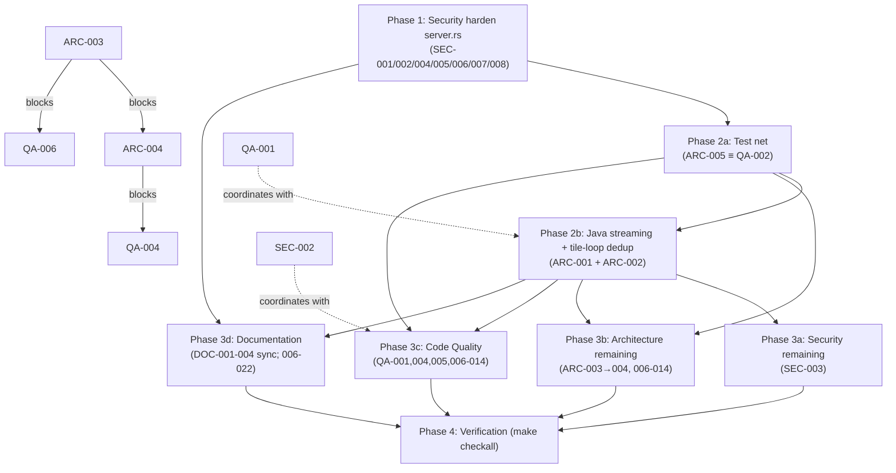

# Project Audit Report

> **Project**: osm-to-bedrock
> **Date**: 2026-07-17
> **Stack**: Rust (CLI + Axum HTTP server, ~12,445 LOC across `src/`) + Next.js/TypeScript web frontend (~6,720 LOC in `web/src/`)
> **Audited by**: Claude Code Audit System (4 parallel expert agents — Architecture, Security, Code Quality, Documentation)

---

## Executive Summary

The codebase is **well-disciplined at the line level** (zero `any` in TypeScript, only one stale `TODO`, careful security hardening for its localhost-dev target, 162 Rust unit tests, reference-quality binary-format docs) but is **carrying serious drift after the Java Edition refactor (0.8.0)**. The single most critical defect is **ARC-001: Java Edition silently abandons the project's streaming-tile architecture** — the entire world accumulates in RAM, so a city-scale `edition=java` conversion OOM-kills the server, and the web `/fetch-convert` endpoint exposes this to any client. The second systemic problem is **documentation drift**: `CLAUDE.md` describes a pipeline that no longer exists (the build loop moved from `main.rs` to `pipeline.rs` across 0.6.0→0.8.0), seven modules are now 1-line re-export shims to an external crate the docs barely mention, the Web UI advertises Java download support it has no selector for, and the primary documented install path (`cargo install osm_to_bedrock`) fails because the crate is not on crates.io.

Estimated effort to clear the top issues: **~3–5 focused days** — land auth + error-disclosure hardening (Phase 1), add the pipeline/world test net and fix Java streaming (Phase 2), then fan out the structural and doc fixes (Phase 3). Genuine strengths below offset much of this: the `WorldWriter` trait is a clean Strategy pattern, the Bedrock streaming + background `ChunkWriter` design is excellent, CI/release is mature, and SSRF/path-traversal/command-injection are all already mitigated.

> **par-mem caveat:** The par-mem code-memory index for this repo stalled during indexing (frozen `scan` stage, unkillable running job) under writer contention and was unavailable for the full audit. All four agents therefore used Glob/Grep/Read for discovery rather than graph analytics (dead-code, complexity, hotspots, centrality). Findings are grounded in direct file reads; function-size and clone counts were computed with `wc`/`awk`/`rg`. Recorded in `~/Repos/PAR-MEM-FEEDBACK.md`.

### Issue Count by Severity

| Severity | Architecture | Security | Code Quality | Documentation | Total |
|----------|:-----------:|:--------:|:------------:|:-------------:|:-----:|
| 🔴 Critical | 1 | 0 | 0 | 4 | **5** |
| 🟠 High     | 4 | 2 | 5 | 6 | **17** |
| 🟡 Medium   | 6 | 3 | 5 | 7 | **21** |
| 🔵 Low      | 3 | 3 | 4 | 5 | **15** |
| **Total**   | **14** | **8** | **14** | **22** | **58** |

---

## 🔴 Critical Issues (Resolve Immediately)

### [ARC-001] Java Edition silently abandons the streaming architecture (OOM risk)
- **Area**: Architecture
- **Location**: `src/pipeline.rs:2030-2174` (the `else` branch of `run_pipeline_streaming`, Java path); `src/anvil.rs:31-108` (`JavaWorld` holds `chunks: HashMap<(i32,i32), ChunkData>` and only writes at `save()`); misleading docstring `src/pipeline.rs:18`; `src/pipeline.rs:2452` in `run_terrain_only_to_disk`.
- **Description**: The streaming tile pipeline is the project's headline design (`docs/ARCHITECTURE.md:201-243` — "bounds memory usage" via 64×64-chunk tiles). The Bedrock branch drains each tile's encoded SubChunks to a background `ChunkWriter` thread and drops the tile before the next iteration. The Java branch does **not** — it allocates one `Box<dyn WorldWriter>` before the tile loop and calls `world.insert_chunk(...)` on every tile, so the entire world accumulates in RAM. The `WorldWriter` trait was bypassed with an `if params.edition == Edition::Bedrock { ... } else { ... }` split instead of extending `ChunkWriter` to Java.
- **Impact**: A city-scale map (~40k chunks × ~24 sub-chunks × ~4 KB ≈ **3.8 GB** of `Block` arrays, plus region-file `Vec<u8>` buffers built contiguously in `encode_region` at `src/anvil.rs:236`) OOM-kills the server. The web `/fetch-convert` endpoint exposes this to any client with a bbox and `edition=java`, and `MAX_CONCURRENT_JOBS = 4` multiplies the worst case.
- **Remedy**: Add a streaming writer for Java — extend `ChunkWriter` (or add a sibling `AnvilChunkWriter`) that lazily groups chunks into 32×32 region files and flushes each region to disk when full or on `finish()`. `WorldWriter::save` is already the seam. If streaming Anvil is deferred, at minimum reject large bboxes for `edition=java` in `validate_convert_options` (`src/server.rs:359`), surface an explicit "Java is in-memory only" warning, and fix the misleading "drains each tile to disk" docstring.
- **Files Affected**: `src/pipeline.rs`, `src/anvil.rs`, `src/world.rs`, `src/server.rs`, `docs/ARCHITECTURE.md`
- **Blocking Notes**: Blocks all Java-Edition scalability/perf work and realistic load-testing; the duplicated tile-loop dedup (ARC-002) must land with it.

### [DOC-001] CLAUDE.md Architecture section describes a pipeline that no longer exists
- **Area**: Documentation
- **Location**: `CLAUDE.md:70-88`
- **Description**: The numbered pipeline describes a "Three-pass loop" living in `main.rs` (`4. **Build world** (main.rs)`). Since 0.6.0 the build loop is the **streaming tile architecture** in `pipeline.rs` (`run_pipeline_streaming`). `main.rs` is now 1254 LOC of clap definitions and dispatch. `CLAUDE.md` never mentions `pipeline.rs`, `geometry.rs`, or `spatial.rs`.
- **Impact**: Every agent and contributor reads `CLAUDE.md` first (it's what `AGENTS.md`/`web/AGENTS.md` redirect to) and is directed at the wrong files and a wrong architecture. This is the doc the whole agent workflow depends on.
- **Remedy**: Rewrite the Architecture section to lead with the streaming tile pipeline in `pipeline.rs`, list `pipeline.rs`/`geometry.rs`/`spatial.rs`/`params.rs`/`sign.rs`/`source_options.rs`/`metadata.rs` as first-class modules, and reconcile with `docs/ARCHITECTURE.md` (which is current).
- **Files Affected**: `CLAUDE.md`
- **Blocking Notes**: Should land before further agent-driven work in this repo. Fold DOC-015 (duplicate "7." numbering) into this rewrite.

### [DOC-002] Docs describe 7 stub modules as containing logic; never mention `par-osm-rust`
- **Area**: Documentation
- **Location**: `CLAUDE.md:74,85-88`; `docs/DEVELOPER_INFO.md:126-140` (Module Tree + per-module sections); `docs/ARCHITECTURE.md:82-90` (Module Responsibilities table).
- **Description**: `src/osm.rs`, `overpass.rs`, `osm_cache.rs`, `filter.rs`, `elevation.rs`, `srtm.rs`, `overture.rs` are each a 1-line re-export shim (`pub use par_osm_rust::*;`). The real implementations live in the external `par-osm-rust = "0.1.1"` crate. Yet all three docs describe these as in-tree modules with concrete responsibilities and never name `par-osm-rust` as the source (only `README.md:64` mentions it once).
- **Impact**: Developers wanting to extend the parser/Overpass/cache/filter/elevation/SRTM/Overture logic will edit empty shim files and find no code; PRs against `src/osm.rs` etc. are no-ops. The "where do I look?" answer is wrong in every doc that touches these 7 modules.
- **Remedy**: Add a "Module layout" note stating `osm`/`overpass`/`osm_cache`/`filter`/`elevation`/`srtm`/`overture` are thin re-export shims from `par-osm-rust` and that extension work belongs in that crate. Annotate `DEVELOPER_INFO.md`'s Module Tree rows with "(re-export from `par-osm-rust`)".
- **Files Affected**: `CLAUDE.md`, `docs/ARCHITECTURE.md`, `docs/DEVELOPER_INFO.md`
- **Blocking Notes**: Do together with DOC-001 and DOC-013 in one coordinated doc-sync pass.

### [DOC-003] `cargo install osm_to_bedrock` (primary documented install) fails — crate not on crates.io
- **Area**: Documentation
- **Location**: `README.md:98-106` (### Cargo Install)
- **Description**: README documents `cargo install osm_to_bedrock` as "Install from crates.io". A live `GET https://crates.io/api/v1/crates/osm_to_bedrock` returns HTTP 404 — the crate is unpublished. Only `cargo install --path .` works.
- **Impact**: Every new user who tries the documented "easy" install gets a build error and assumes the project is broken.
- **Remedy**: Either publish `osm_to_bedrock` to crates.io and verify the command works, or demote the crates.io block to "coming soon" and point users to pre-built binaries / `cargo install --path .`.
- **Files Affected**: `README.md`
- **Blocking Notes**: Publish-vs-demote is a maintainer decision; fix runs after that call. (DOC-011 docstring coverage should be a precondition if publishing.)

### [DOC-004] Web UI advertises Java Edition `.zip` download but has no UI selector
- **Area**: Documentation (also a feature gap)
- **Location**: `README.md:268-272`; `docs/WEB_UI.md:50,269`; absent selector in `web/src/components/ConversionParametersForm.tsx`.
- **Description**: README claims the Web Explorer offers "Direct `.mcworld` (Bedrock) or `.zip` (Java) download". The actual form exposes scale/height/sea-level/etc. controls but **no `edition` selector** — `grep -rn 'edition|java|Java' web/src/` returns zero matches. The Rust server accepts `edition` and emits `.zip` for Java, but the Next.js frontend never sends it.
- **Impact**: Users who come to the Web UI for Java Edition will not find the feature and conclude it's broken. The docs describe vaporware.
- **Remedy**: (1) **Docs (immediate)**: change README/WEB_UI.md to "`.mcworld` (Bedrock) download" or note Java is CLI-only for now. (2) **Code (separate feature task)**: add an `edition` selector to `ConversionParametersForm`, thread it through `useConversion` → proxy route → Rust request body.
- **Files Affected**: `README.md`, `docs/WEB_UI.md` (doc fix); `web/src/components/ConversionParametersForm.tsx`, `web/src/hooks/useConversion.ts`, proxy routes (separate code task)
- **Blocking Notes**: The doc correction is independent and should land immediately; the UI selector is a separate feature, not a blocker for the doc fix.

---

## 🟠 High Priority Issues

### [ARC-002] ~300 LOC of duplicated Bedrock/Java tile-loop code
- **Area**: Architecture · **Location**: `src/pipeline.rs:1854-2029` (Bedrock) vs `:2030-2174` (Java); duplicated again at `:2364` (terrain-only).
- **Description**: Terrain-fill rayon loop, spatial-filter buckets, relation bbox-overlap filter, `RenderContext`/`TileWays` assembly, and the `render_osm_features` call are byte-for-byte duplicated between branches; the only real difference is the writer handle (`drain_chunks_to_writer` vs no drain). The `WorldWriter` trait was meant to eliminate this, but Bedrock grew a `drain_chunks_to_writer` method the trait doesn't know about, so callers branch on edition.
- **Impact**: Any terrain-fill/spatial-filter/tile-iteration change must be applied in 2–3 places; bug fixes drift between editions (progress-phase labels already differ). Blocks ARC-001 — a Java streaming writer can't be inserted cleanly while the loop body is edition-specialized.
- **Remedy**: Hoist a `process_tile` helper taking `&mut dyn WorldWriter` + pre-computed indices; extend `WorldWriter` with `flush_tile()` (no-op for Java per-tile, drains for Bedrock). Outer loop then has zero edition-specific code.
- **Files Affected**: `src/pipeline.rs`, `src/world.rs`, `src/bedrock.rs`, `src/anvil.rs`
- **Blocking Notes**: Must be done **together with ARC-001** — same tile loop.

### [ARC-003] `pipeline.rs` is a 2609-LOC god module with a 561-line function
- **Area**: Architecture · **Location**: `src/pipeline.rs` (entire file). Hotspots: `render_osm_features` (`:257-818`, 561 LOC); `run_pipeline_streaming` (`:1740-2180`, 455 LOC); `run_surface_preview` 252; `run_terrain_only_to_disk` 240.
- **Description**: One file mixes 7 concerns: zip archiving, bytes formatting, feature rendering, POI/tree decoration, bounds/geometry, OSM resolution, and 9 overlapping public entry points (`run_conversion` vs `run_conversion_from_data` vs `run_conversion_preview` vs `run_preview_from_data` — the distinctions are not obvious from names).
- **Impact**: Largest source of risk in the codebase, with zero tests (ARC-005). Adding a layer means modifying one 561-line function.
- **Remedy**: Split into a `pipeline/` directory: `mod.rs` (entry points + dispatch), `render.rs` (per-layer `render_roads`/`render_buildings`/…), `decorations.rs`, `terrain.rs`, `preview.rs`, `util.rs`. Fold redundant `*_from_data`/`*_preview` variants.
- **Files Affected**: `src/pipeline.rs` (split), `src/lib.rs`, `src/main.rs`, `src/server.rs`
- **Blocking Notes**: Follow ARC-001/ARC-002; precedes ARC-004 (server split needs the ConvertParams patterns this surfaces). Touches every consumer of `pipeline::*`.

### [ARC-004] `server.rs` is a 2347-LOC god module with duplicate handler bodies
- **Area**: Architecture · **Location**: `src/server.rs` (entire file); 8 handlers each ~150–185 LOC (`convert_handler:825`, `fetch_convert_handler:1369`, `terrain_convert_handler:1618`, `overture_convert_handler:1745`, `preview_handler:1125`, `parse_pbf_handler:630`, `fetch_preview_handler:748`, `fetch_block_preview_handler:1268`).
- **Description**: One file holds `ApiError`, `JobState`/`AppState`/`Jobs`, 12 request/response structs, 3 `validate_*` functions, 11+ serde `default_*` functions, all handlers, CORS resolver, router/state builders, eviction task, and orphan-temp-dir cleanup. Each conversion handler repeats the same 8-step pattern (parse → validate → semaphore → job_id → spawn_blocking → temp file/dir → ConvertParams → run → zip).
- **Impact**: A new endpoint requires copy-pasting ~150 LOC; concurrent bug fixes must be applied in 5 places; the 12 inline request structs make the API surface unauditable.
- **Remedy**: Split into `server/{mod,state,error,options/,handlers/}`; extract `run_background_conversion(jobs, semaphore, params, edition, world_name)`. Replace `serde(default=...)` free functions with `Default` impls.
- **Files Affected**: `src/server.rs`, `src/lib.rs`, `src/main.rs`
- **Blocking Notes**: After ARC-003.

### [ARC-005] `pipeline.rs` and `world.rs` have zero tests; the orchestrator is untested
- **Area**: Architecture · **Location**: `src/pipeline.rs` (0 tests / 2609 LOC), `src/world.rs` (0 tests — owns `WorldWriter` + `ChunkData`), `src/params.rs` (0), `src/nbt.rs` (0). Tests are concentrated in leaf modules (`blocks.rs` 43, `server.rs` 19, `geojson_export.rs` 18, `convert.rs` 14, `nbt_be.rs` 12).
- **Description**: The riskiest code — the pipeline that orchestrates parse → render → write, the `ChunkData` XZY indexing (`idx = lx*256 + lz*16 + ly`) both backends depend on, and the `WorldWriter` trait — has no coverage. A `ChunkData::set/get` off-by-one would silently corrupt every world. The edition-dispatch seam (where ARC-001 lives) has no parity test.
- **Impact**: ARC-001 went uncaught; the next refactor ships with no safety net; library consumers have no documented contract.
- **Remedy**: (1) `ChunkData` round-trip tests at sub-chunk boundaries; (2) `render_osm_features` integration test against a `Vec<(x,y,z,Block)>`-capturing test `WorldWriter`; (3) cross-edition parity test (Bedrock vs Java decode to matching block placements); (4) doctest the `run_conversion` contract sketched in `src/lib.rs:10-43`.
- **Files Affected**: `src/world.rs`, `src/pipeline.rs`, `src/params.rs`, `src/nbt.rs`
- **Blocking Notes**: **Must precede ARC-002/003/004 and QA-006** — tests are the prerequisite that makes structural refactors safe. (Overlaps QA-002 — treat as merged.)

### [SEC-001] No authentication or authorization on any HTTP endpoint
- **Area**: Security · **Location**: `src/server.rs:2099-2134` (router); `docker-entrypoint.sh:7` (`serve --host 0.0.0.0`).
- **Description**: No `Authorization` header, API key, session, or per-job ownership — the server relies entirely on the loopback bind. The Docker entrypoint overrides that with `--host 0.0.0.0`, so any client that can reach port 3002/8031 can submit multi-hundred-MB uploads, enumerate cached Overpass bboxes (`GET /cache/areas`), and download any completed job by UUID.
- **Impact**: Resource-exhaustion DoS, cross-tenant data access in shared deployments, unauthorised compute/Overpass-quota use. (Job IDs are UUIDv4, so blind enumeration is infeasible — but anyone observing an ID in logs/traffic can fetch the world.)
- **Remedy**: Add opt-in shared-secret middleware gated behind `--api-key`/`OSM_TO_BEDROCK_API_KEY`; check it on mutating routes and `/download`/`/status`/`/cache`. Document that the Docker image must sit behind an authenticating reverse proxy. At minimum, refuse to start when `--host 0.0.0.0` is set and no key is configured.
- **Files Affected**: `src/server.rs`, `src/main.rs`, `docker-entrypoint.sh`, `Dockerfile`
- **Blocking Notes**: Must precede any change exposing the server beyond loopback; precede code-quality/feature work on `server.rs` handlers.

### [SEC-002] Internal error chains leaked verbatim via `/status` and `/download`
- **Area**: Security · **Location**: `src/server.rs:1009-1019` (status), `:1096-1101` (download), `:188-198` (`set_job_error` sites).
- **Description**: `ApiError` is well-designed (generic 500 body, full chain only logged), but two endpoints bypass it: `status_handler` returns `Json({state:"error", message: <verbatim JobState::Error.message>})` where message is `format!("Conversion failed: {e}")` etc., and `download_handler` returns `format!("failed to read mcworld file: {e}")`. The `{e}` interpolation includes the full `anyhow` chain and OS strings — temp paths, OS error numbers, LevelDB internals.
- **Impact**: Filesystem-layout disclosure, OS/version fingerprinting, easier follow-on exploitation.
- **Remedy**: Return a generic `"conversion failed"` string to the client and keep the detail in logs only. Store a separate `public_message` on `JobState::Error` (or always render a fixed response string). Apply the same in `download_handler`'s read-error branch.
- **Files Affected**: `src/server.rs`
- **Blocking Notes**: Coordinate with QA work on the same handlers (the `JobState::Error.message` field is written by workers, read by `status_handler`).

### [QA-001] Bedrock/Java `WorldWriter` implementations are ~80% copy-paste
- **Area**: Code Quality · **Location**: `src/bedrock.rs:356-456` + `:570-606` vs `src/anvil.rs:110-202`; trait at `src/world.rs:117-160`.
- **Description**: Both backends hold the identical struct shape (`chunks`, `block_entities`, `sign_directions`, `block_directions`, `chunk_bounds`) and implement `set_block`/`get_block`/`insert_chunk`/`add_block_entity`/`set_sign_direction`/`set_block_direction`/`chunk_count`/`occupied_chunks`/`surface_blocks`/`in_bounds`/`new` byte-for-byte identically. Only `save()` and the palette encoders differ. The `WorldWriter` trait defines 10 methods with **zero default impls**.
- **Impact**: ~150 lines of pure duplication; bounds-checking/storage-semantics fixes must be applied twice and have already drifted subtly (Bedrock has `drain_chunks_to_writer`/`get_sign_direction`/`write_level_dat` Java lacks).
- **Remedy**: Extract a `ChunkStore` struct holding the shared fields + the shared methods; both backends hold a `ChunkStore` and delegate. Provide default impls on `WorldWriter` routing through `self.store()`.
- **Files Affected**: `src/world.rs`, `src/bedrock.rs`, `src/anvil.rs`
- **Blocking Notes**: Coordinate with ARC-002 (both touch the writer trait); otherwise independent.

### [QA-002] `pipeline.rs` (2609 LOC, the central orchestrator) has zero tests
- **Area**: Code Quality · **Location**: `src/pipeline.rs` (entire file — `rg '#\[test\]' src/pipeline.rs` returns nothing).
- **Description**: Every other core module has tests; `pipeline.rs` has none. Contains the two largest functions (`render_osm_features` 561 LOC, `run_pipeline_streaming` 455 LOC). The graphify-removal commit (59f80b8) is exactly the kind of change that could leave orphaned calls unnoticed.
- **Impact**: Layering/height-map/closed-way regressions silently produce wrong worlds.
- **Remedy**: Build a tiny synthetic `OsmData` (road + building + water), run `run_conversion_from_data` against a `tempdir`, assert chunk count and expected block kinds. A `RecordingWorld` impl of `WorldWriter` lets `render_osm_features` be tested directly.
- **Files Affected**: `src/pipeline.rs`
- **Blocking Notes**: **Merged with ARC-005** (same underlying gap; do once, in Phase 2).

### [QA-003] Mutex poisoning panics the API server on any job-thread failure
- **Area**: Code Quality · **Location**: `src/server.rs` — 22 `.lock().expect("jobs lock poisoned")` sites (e.g. `:153, 186, 868, 960, 991, 1022, 1393, 1441, 1527, 1635, 1702, 1762, 1803, 1890, 1966, 2021, 2042`); `src/bedrock.rs:194,200`.
- **Description**: The shared `Jobs` map is `Arc<Mutex<HashMap<...>>>`. If any code panics while holding the lock, the mutex poisons and the **next request crashes the server** with "jobs lock poisoned". The eviction task would also panic.
- **Impact**: One bad input (e.g. a debug-mode integer overflow per SEC-004, or an `unwrap` deep in the pipeline) takes down the whole API rather than failing one job.
- **Remedy**: Replace `.expect(...)` with a helper that recovers from `PoisonError` via `e.into_inner()` (the lock is still usable). For the `bedrock.rs` writer thread, use `parking_lot::Mutex` (no poisoning) or `expect` only inside the recoverable writer thread.
- **Files Affected**: `src/server.rs`, `src/bedrock.rs`
- **Blocking Notes**: **Merged with SEC-006** (same defect; do once, in Phase 1). QA-004's helper extraction should land after.

### [QA-004] Four HTTP handlers duplicate the same job-state boilerplate
- **Area**: Code Quality · **Location**: `src/server.rs:825-987`, `:1369-1591`, `:1618-1745`, `:1745-1890` (semaphore `try_acquire_owned` at lines 860, 1387, 1629, 1756).
- **Description**: Each repeats ~100 lines: acquire semaphore → UUID → insert `JobState::Running` → clone state into the spawned task → `spawn_blocking` → `set_job_error` on failure / `JobState::Done` on success. Bodies differ only in the inner `run_conversion_*` call and progress-phase helper.
- **Impact**: ~400 lines of duplicated control flow; adding cancellation/progress-throttling means editing four handlers in lockstep.
- **Remedy**: Extract `spawn_conversion_job<F>(state, kind, work)`; each handler becomes ~30 lines.
- **Files Affected**: `src/server.rs`
- **Blocking Notes**: After QA-003/SEC-006 (the helper is the natural home for lock-recovery); coordinate with ARC-004 (server split).

### [QA-005] `merged_data.unwrap()` reachable with empty input list
- **Area**: Code Quality · **Location**: `src/server.rs:667`.
- **Description**: The merge loop sets `merged_data = Some(data)` only inside the loop; after it, `Ok(merged_data.unwrap())`. If `file_bytes_list` is ever empty, this panics inside `spawn_blocking` → 500 with no useful message.
- **Impact**: Today the multipart parser guarantees ≥1 file, but nothing in the function enforces it; a future refactor/test could trip it.
- **Remedy**: `merged_data.ok_or_else(|| anyhow::anyhow!("no OSM files were uploaded"))?`.
- **Files Affected**: `src/server.rs`
- **Blocking Notes**: One-line fix; none.

### [DOC-005] `CLAUDE.md` endpoint list missing 3 live routes
- **Area**: Documentation · **Location**: `CLAUDE.md:55-64`.
- **Description**: `CLAUDE.md` lists 9 endpoints; the actual `Router::new()` (`src/server.rs:2114-2135`) registers 12. Missing: `POST /fetch-preview`, `POST /fetch-block-preview`, `POST /overture-convert`. `docs/ARCHITECTURE.md` and `docs/WEB_UI.md` are correct — only `CLAUDE.md` is stale.
- **Remedy**: Sync `CLAUDE.md` to match `docs/ARCHITECTURE.md` (add the three rows).
- **Files Affected**: `CLAUDE.md` · **Blocking Notes**: none (fold into DOC-001 rewrite).

### [DOC-006] Docker deployment is undocumented despite Dockerfile + entrypoint shipping
- **Area**: Documentation · **Location**: no Docker section in `README.md`/`docs/CLI.md`; `Dockerfile`, `docker-entrypoint.sh`, `Makefile:80-87` (`docker-build`/`docker-run`/`docker-stop`).
- **Description**: A working three-stage Dockerfile + entrypoint + three Make targets ship, but none are documented. The entrypoint accepts undocumented env vars `API_PORT` (default 3002) and `PORT` (default 8031). `Dockerfile:23,48` bake `NEXT_PUBLIC_API_URL=http://localhost:3002` at build time — a remote-deploy gotcha.
- **Remedy**: Add a "Docker / Self-hosting" section (or `docs/DEPLOYMENT.md`): `make docker-build && docker-run`, document `API_PORT`/`PORT`/`NEXT_PUBLIC_API_URL`, list the `make docker-*` targets.
- **Files Affected**: `README.md`, (new) `docs/DEPLOYMENT.md`, `docs/README.md` · **Blocking Notes**: Do with DOC-007.

### [DOC-007] `CORS_ALLOWED_ORIGIN` env var is undocumented
- **Area**: Documentation · **Location**: `docs/CLI.md:248-253` env table; `CHANGELOG.md:43`; used in `src/server.rs` via `cors_allowed_origin()`.
- **Description**: Default `http://localhost:8031`, configurable via `CORS_ALLOWED_ORIGIN`, but absent from `docs/CLI.md`'s env table and README. Operators deploying behind a non-default frontend host hit silent CORS failures.
- **Remedy**: Add `CORS_ALLOWED_ORIGIN` to the env table; mention in the new Deployment section.
- **Files Affected**: `docs/CLI.md`, `README.md` · **Blocking Notes**: Do with DOC-006.

### [DOC-008] CHANGELOG link references broken for 0.8.0
- **Area**: Documentation · **Location**: `CHANGELOG.md:151-158`.
- **Description**: `[Unreleased]` compares against `v0.7.0` (should be `v0.8.0`), and there is no `[0.8.0]` reference, so the inline `[0.8.0]` link renders as raw text.
- **Remedy**: Update line 151 to `compare/v0.8.0...HEAD` and add `[0.8.0]: compare/v0.7.0...v0.8.0`.
- **Files Affected**: `CHANGELOG.md` · **Blocking Notes**: none.

### [DOC-009] `make install-hooks` installs stale graphify git hooks
- **Area**: Documentation · **Location**: `Makefile:76-78`; `.githooks/post-commit`, `.githooks/post-checkout`; `CHANGELOG.md:50`.
- **Description**: Commit `59f80b8` removed graphify from settings/gitignore/CLAUDE.md, but the local `.githooks/post-commit`/`post-checkout` still contain the full graphify hook implementation. `install-hooks` runs `git config core.hooksPath .githooks`, silently re-enabling the just-removed integration. (`pre-commit` is the legitimate fmt/clippy/test hook — keep it.)
- **Remedy**: Delete the two graphify hook files in the working tree; decide whether to drop `install-hooks` or restrict it to `pre-commit`; add a `[Unreleased]/Removed` CHANGELOG entry.
- **Files Affected**: `Makefile`, `.githooks/post-commit`, `.githooks/post-checkout`, `CHANGELOG.md` · **Blocking Notes**: maintainer decision (drop target vs. clean files).

### [DOC-010] `docs/ARCHITECTURE.md` lists `parse`/`overpass` as Clap subcommands that don't exist
- **Area**: Documentation · **Location**: `docs/ARCHITECTURE.md:77`.
- **Description**: Line 77 lists `convert, serve, parse, overpass, terrain-convert, cache`. Actual `enum Commands` (`src/main.rs:43-57`): `Convert, Serve, FetchConvert, TerrainConvert, OvertureConvert, Cache`. `parse`/`overpass` never existed; `fetch-convert`/`overture-convert` are omitted.
- **Remedy**: Update to `convert, serve, fetch-convert, terrain-convert, overture-convert, cache`.
- **Files Affected**: `docs/ARCHITECTURE.md` · **Blocking Notes**: none (fold with DOC-002 doc-sync).

---

## 🟡 Medium Priority Issues

### Architecture
| ID | Title | Location | Remedy (summary) |
|----|-------|----------|------------------|
| ARC-006 | `NEXT_PUBLIC_API_URL` baked into Docker at build time, resolves to localhost | `Dockerfile:23,48`; `web/src/lib/api-config.ts:10-11` | Drop the `NEXT_PUBLIC_` var (rename to server-side `RUST_API_URL`) or document it's server-side only; use Next.js runtime config if browser-callable URLs are ever needed. |
| ARC-007 | 13 web proxy routes duplicate fetch-with-timeout boilerplate | `web/src/app/api/*/route.ts` (707 LOC) | Add `proxyToRust(path, {method, body, timeoutMs})`; standardize error envelope once. |
| ARC-008 | `main.rs` 1254 LOC with all CLI structs and two `run_*` inline | `src/main.rs` | Extract `cli/{args,convert,cache,mod}.rs`; share flag groups via `#[derive(clap::Args)]`. |
| ARC-009 | Web frontend has zero tests; `useMap`/`useConversion` untested | `web/src/hooks/*` (no `.test.ts`); CI runs only `lint`+`build` | Add `vitest` + testing-library; test polling state machine + cleanup; gate CI. |
| ARC-010 | `Arc<Mutex<HashMap>>` job state contended under concurrency cap | `src/server.rs:126`; 12 lock sites | `Arc<DashMap>` for the read-heavy status path, or per-job `Arc<Mutex<JobState>>`. |
| ARC-011 | `params.rs` re-exports 7 types from `par-osm-rust` (0.x), leaky seam | `src/params.rs:8-9`; 7 stub files; `Cargo.toml` | Pin `par-osm-rust` (`=0.1.1`/`~0.1.1`); decide whether stubs add clarity; donate `source_options.rs` upstream. |

### Security
| ID | Title | Location | Remedy (summary) |
|----|-------|----------|------------------|
| SEC-003 | No `Content-Security-Policy` header on the Next.js frontend | `web/next.config.ts:6-22` | Add a restrictive CSP (`default-src 'self'`; `connect-src` to Overpass/Nominatim/tile origins; `script-src 'self'`). |
| SEC-004 | Unvalidated `bbox` ranges allow memory exhaustion / integer overflow | `src/server.rs:751,1267,1397`; `src/pipeline.rs:1334,2338` | Add `validate_bbox` (±90/±180 + max span sized to `scale=100` budget); call in fetch/terrain/preview handlers before semaphore. |
| SEC-005 | JSON routes rely on Axum's implicit 2 MiB body limit | `src/server.rs:2129-2132` | Apply explicit `DefaultBodyLimit::max(...)` to the JSON routes. |

### Code Quality
| ID | Title | Location | Remedy (summary) |
|----|-------|----------|------------------|
| QA-006 | Two `pipeline.rs` functions exceed 450 lines | `src/pipeline.rs:257-817` (`render_osm_features` 561), `:1740-2194` (`run_pipeline_streaming` 455) | Extract per-layer `render_*` and `build_height_map`/`fill_terrain`/`overlay_features`. After QA-002/ARC-005. |
| QA-007 | `validate_convert_options` and `validate_fetch_convert_options` near-identical | `src/server.rs:359-405` | Shared `ConvertNumericBounds` view validated once. |
| QA-008 | 18 `#[allow(dead_code)]` markers — speculative shipped code | `src/blocks.rs:8,264,279,281,352`; `bedrock.rs:416,453,459,491`; `world.rs:23,169,178`; `convert.rs:46,52`; `pipeline.rs:223,2194`; `geojson_export.rs:219`; `server.rs:2002` | Audit each: implement/remove the orphans, leave intentional ones with a one-line comment. |
| QA-009 | `useConversion.ts` (545 LOC) duplicates 4 fetch-and-poll flows | `web/src/hooks/useConversion.ts` | Extract `runConversionJob(url, body, opts)`; each method a 5-line wrapper. |
| QA-010 | `useEffect` cleanup gap in `useConversion` polling | `web/src/hooks/useConversion.ts:128` (`res.body!`), polling ~L158 | Add `AbortController` in a `useRef`, abort on unmount; replace `res.body!` with a null guard. |

### Documentation
| ID | Title | Location | Remedy (summary) |
|----|-------|----------|------------------|
| DOC-011 | Docstring coverage uneven (server.rs 0/4, blocks.rs variants 0-41) | `src/server.rs:241,254,263,2003`; `src/blocks.rs:11-52`; `src/anvil.rs` | Backfill `///` on the 4 server items, Block variants 0-41, 2 anvil items. Precondition for crates.io publish. |
| DOC-012 | `docs/ARCHITECTURE.md` says Block "60+ variants"; actual is 56 | `docs/ARCHITECTURE.md:94` | Change to "56 variants". |
| DOC-013 | `docs/DEVELOPER_INFO.md` omits 9 post-refactor files | `docs/DEVELOPER_INFO.md:112-148` | Add `world.rs`/`anvil.rs`/`nbt_be.rs`/`source_options.rs` to Module Tree; add per-module sections for pipeline/geometry/spatial/world/anvil/nbt_be. Fold with DOC-001/002. |
| DOC-014 | `CONTRIBUTING.md` Project Layout and `make checkall` description stale | `CONTRIBUTING.md:51,124-132` | Update to "fmt + lint + typecheck + test + web-check"; note Java Edition files + Dockerfile. |
| DOC-015 | `CLAUDE.md` numbered list has two items numbered "7" | `CLAUDE.md:82-83` | Renumber from line 83; fold into DOC-001 rewrite. |
| DOC-016 | `docs/CLI.md` Config File section doesn't enumerate all 26 YAML keys | `docs/CLI.md:221-245`; `src/config.rs:17-44` | Replace example with a full 26-key table (type/default/honored-by). |
| DOC-017 | `docs/WEB_UI.md` Bedrock-only language; contradicts README Java claim | `docs/WEB_UI.md:1-3,50,269` | Reconcile with DOC-004 (Bedrock-only for now, or document the new `edition` field when added). |

---

## 🔵 Low Priority / Improvements

### Architecture
- **ARC-012** — `zip_directory`/`format_bytes` don't belong in `pipeline.rs` (`:109`,`:204`). Move to `util.rs`/`metadata.rs`.
- **ARC-013** — `Block` enum mixes terrain + POI-decoration blocks in one flat namespace (`src/blocks.rs:10-81`). Optional split or section comments.
- **ARC-014** — `docs/ARCHITECTURE.md` API endpoint table stale (`:301-314`, missing `/fetch-preview` etc.). Sync from `src/server.rs` router. (Overlaps DOC-005/DOC-010.)

### Security
- **SEC-006** — Mutex poisoning locks up status/download path (23 `.lock().expect()` sites). **Merged with QA-003** — fix once in Phase 1.
- **SEC-007** — `/cache/areas` enumerates cached bboxes without auth (`src/server.rs:1964-1969`). Gate behind SEC-001 auth.
- **SEC-008** — Client errors return 500 instead of 400 (`src/server.rs:683,859-860,1108-1110,1145-1147`). Use `ApiError::bad_request(...)`.

### Code Quality
- **QA-011** — 1-line re-export stub modules are cosmetically odd but **not dead code** (callers exist). Leave as-is or consolidate into one `src/par.rs`.
- **QA-012** — Stale TODO (`web/src/app/page.tsx:313`, "restore settings from history entry"). Implement or convert to a GitHub issue.
- **QA-013** — `_y` param unused/undocumented in `add_block_entity` (`src/bedrock.rs:425`, `src/anvil.rs:155`). Document the contract or key by `y`.
- **QA-014** — `console.error` left in production web code (`web/src/hooks/useMap.ts:473`). Route through error state or leave (only one in codebase).

### Documentation
- **DOC-018** — `server.log` (untracked, gitignored) in working tree. `rm` locally.
- **DOC-019** — Root `AGENTS.md` is a 16-byte stub pointer. Leave or fold into README Contributing.
- **DOC-020** — Release-marketing artifacts (`reddit_release.md`, `hackernews_release.md`, `gallery.html`) tracked at root. Optional move to `release/`.
- **DOC-021** — CHANGELOG `---` separator inconsistency (0.7.0/0.8.0 lack it). Normalize.
- **DOC-022** — README Makefile command list omits ~9 targets (`serve-stop`, `web-check`, `docker-*`, …). Add or point to Makefile.

---

## Detailed Findings

### Architecture & Design
Overall **Fair**. The foundations — `WorldWriter` Strategy trait, Bedrock streaming-tile + background `ChunkWriter`, library/binary split, mature CI/release — are Good. The Java-Edition addition broke the central scalability design (ARC-001), and `pipeline.rs` (2609 LOC) and `server.rs` (2347 LOC) are past the point where the next refactor is safe without first adding tests (ARC-005). The duplicated Bedrock/Java tile loop (ARC-002) and the par-osm-rust re-export seam (ARC-011) are secondary structural smells. 14 findings (1 Critical, 4 High, 6 Medium, 3 Low).

### Security Assessment
Overall **Good** for intended localhost use. SSRF is solid (HTTPS-only + userinfo rejection + host allowlist, defence-in-depth in the Next.js proxy), path traversal is mitigated (UUID job keys + `sanitize_world_name` with 11 tests), no command injection (`overturemaps` via `Command::new` with discrete args), no `unsafe`/XSS/hardcoded secrets, sensible upload limits and DoS caps, strict single-origin CORS. Gaps: no auth model (SEC-001) — critical once Docker's `0.0.0.0` bind is used; verbatim error-chain leakage (SEC-002); no CSP (SEC-003); unvalidated bbox (SEC-004); mutex poisoning (SEC-006). 8 findings (0 Critical, 2 High, 3 Medium, 3 Low).

### Code Quality
Overall **Good**. Unusually disciplined for its size: zero `any` in TS (3 non-null assertions total), one stale TODO, careful SubChunk-format docs, 162 unit tests. Debt is concentrated in (a) structural duplication — WorldWriter ~80% copy-paste (QA-001), 4 duplicated server handlers (QA-004), duplicated validation (QA-007), duplicated conversion flows (QA-009); and (b) the untested pipeline orchestrator (QA-002/ARC-005). The mutex-poisoning crash risk (QA-003/SEC-006) and the `merged_data.unwrap()` latent panic (QA-005) are the highest-impact quality defects. 14 findings (0 Critical, 5 High, 5 Medium, 4 Low).

### Documentation Review
Overall **Fair**. User-facing docs (README, `docs/CLI.md`, `docs/ARCHITECTURE.md`, CHANGELOG, `docs/WEB_UI.md`, style guide) are Good-to-Excellent; `docs/ARCHITECTURE.md` is the model the others should follow. But the agent-facing `CLAUDE.md` and the developer-reference `docs/DEVELOPER_INFO.md` have **material drift** from the post-refactor codebase: wrong pipeline architecture (DOC-001), 7 stub modules described as real (DOC-002), missing routes/subcommands (DOC-005/010), and a broken primary install path (DOC-003). The Web UI advertises Java support it cannot expose (DOC-004). Deployment is undocumented (DOC-006/007). 22 findings (4 Critical, 6 High, 7 Medium, 5 Low) — the largest finding count of any domain, reflecting accumulated drift.

---

## Remediation Roadmap

### Immediate Actions (Before Next Deployment)
1. **ARC-001** — Fix Java-Edition streaming (or reject large bboxes for `edition=java` + correct the misleading docstring).
2. **SEC-001** — Add opt-in auth middleware; refuse `0.0.0.0` bind without a key.
3. **SEC-002** — Stop leaking verbatim error chains from `/status` and `/download`.
4. **DOC-001 / DOC-002 / DOC-004 (doc part)** — Correct CLAUDE.md architecture, stub-module reality, and the Java-Web-UI claim.
5. **DOC-003** — Publish to crates.io or demote the broken install instructions.

### Short-term (Next 1–2 Sprints)
1. **ARC-005 + QA-002** — Add the pipeline/world/params/nbt test net (gates everything below).
2. **ARC-002** — Collapse the duplicated Bedrock/Java tile loop with ARC-001.
3. **QA-003 + SEC-006** — Eliminate mutex poisoning; extract `spawn_conversion_job` (QA-004).
4. **ARC-003 → ARC-004** — Split `pipeline.rs` then `server.rs` into module directories.
5. **QA-001** — Extract `ChunkStore` to dedup the two `WorldWriter` backends.
6. **SEC-004 / SEC-005 / SEC-008** — bbox validation, explicit body limits, correct status codes.
7. **DOC-006 + DOC-007** — Docker/deployment guide + `CORS_ALLOWED_ORIGIN`.
8. **DOC-009** — Remove stale graphify hooks; **DOC-008** — fix CHANGELOG links.

### Long-term (Backlog)
1. **ARC-007** — `proxyToRust` helper for the 13 web proxy routes; standardize error envelope.
2. **ARC-009** — Add `vitest` and web test coverage for `useMap`/`useConversion`.
3. **ARC-008** — Split `main.rs` into a `cli/` module.
4. **ARC-010** — `DashMap` for the read-heavy job-status path.
5. **ARC-011** — Pin `par-osm-rust`; resolve the stub-module seam.
6. **QA-008 / QA-009 / QA-010** — dead-code audit, dedup conversion hook, add `AbortController`.
7. **DOC-011 / DOC-016** — rustdoc backfill + full config-key table (preconditions for crates.io).
8. **DOC-004 (UI selector)** — Add the `edition` selector to the Web UI (separate feature task).

---

## Positive Highlights

1. **`WorldWriter` is a textbook Strategy pattern** (`src/world.rs:132-163`) — `BedrockWorld` and `JavaWorld` both implement it, `ChunkData` is shared, and `Edition::create_world` cleanly encapsulates edition selection. The duplication that exists (QA-001) is mechanical; the architecture is right.
2. **The Bedrock streaming-tile + background-writer design is excellent** — `ChunkWriter` (`src/bedrock.rs:154`) owns the LevelDB handle on a dedicated thread, encoders ship bytes via a bounded channel, tiles drop after encoding. The right architecture for the problem; documented precisely in `docs/ARCHITECTURE.md`.
3. **Security hardening is in the right places** — SSRF allowlist + userinfo rejection, `sanitize_world_name` (11 path-traversal/header-injection tests), no `unsafe`/XSS/secrets, `MAX_CONCURRENT_JOBS=4` + `JOB_TTL` eviction, strict single-origin CORS, atomic SRTM cache writes with retry.
4. **CI and release pipeline are mature** — fmt+clippy(`-D warnings`)+test for Rust and install+build+lint for web on every push; release workflow builds 5 platform binaries with SHA256 checksums, publishes to crates.io with an "already-published" skip, and creates GitHub releases with pinned action versions.
5. **Exceptional TypeScript discipline** — zero `any` across 6,720 LOC, only 3 non-null assertions, and the 5 disabled lint rules all carry explanatory comments (the good kind of suppression).
6. **Reference-quality binary-format docs** — the Bedrock chunk-key and SubChunk v8 byte-format comments (`src/bedrock.rs:1-52`) and the `ChunkWriter` design rationale are exactly what's needed to safely touch the format.
7. **The library/binary split is correct** — `[lib]` + `[[bin]]` make conversion logic reusable as `osm_to_bedrock::pipeline::run_conversion` with a working doctest example in `src/lib.rs`.
8. **`docs/ARCHITECTURE.md` is genuinely strong** — streaming pipeline, both editions, all 12 endpoints, two well-formed Mermaid diagrams, key-decisions table. The model for what `CLAUDE.md` and `DEVELOPER_INFO.md` should become.

---

## Audit Confidence

| Area | Files Reviewed | Confidence |
|------|---------------|-----------|
| Architecture | ~22 (Cargo.toml, lib.rs, pipeline.rs, main.rs, world.rs, server.rs, config.rs, params.rs, source_options.rs, docs/ARCHITECTURE.md, Makefile, Dockerfile, web/package.json, web/src/app layout, all proxy routes, hooks) | High |
| Security | ~14 (server.rs, overpass/cache/elevation/srtm logic via pipeline.rs, web API routes, lib/api.ts, next.config.ts, Cargo.toml, Dockerfile, docker-entrypoint.sh) | High |
| Code Quality | ~18 (all src/*.rs by LOC rank, all web/src by LOC rank, test modules, lint configs, git log) | High |
| Documentation | ~22 (README, CHANGELOG, CONTRIBUTING, CLAUDE.md, AGENTS.md, all docs/*, web README/AGENTS/CLAUDE, Dockerfile, Makefile, .githooks) | High |

*All four agents worked from direct file reads (par-mem graph analytics were unavailable due to a stalled index — see Executive Summary caveat). Findings are grounded in cited file:line evidence.*

---

## Remediation Plan

> This section is generated by the audit and consumed directly by `/fix-audit`.
> It pre-computes phase assignments and file conflicts so the fix orchestrator
> can proceed without re-analyzing the codebase.

### Phase Assignments

#### Phase 1 — Security hardening of `src/server.rs` (Sequential, Blocking)
> `src/server.rs` is the worst conflict file (all four domains edit it). All Security findings that touch it are promoted here — by file-conflict, not severity — so the server is hardened **before** Code Quality refactors its handlers. SEC-006/QA-003 (mutex poisoning) are merged into one fix here.
<!-- Severities are mixed because promotion is by file-conflict, not severity. -->
| ID | Title | File(s) | Severity |
|----|-------|---------|----------|
| SEC-001 | Auth middleware + refuse `0.0.0.0` without key | `src/server.rs`, `src/main.rs`, `docker-entrypoint.sh`, `Dockerfile` | High |
| SEC-002 | Stop leaking verbatim error chains from `/status`,`/download` | `src/server.rs` | High |
| SEC-004 | `validate_bbox` (range + max span) | `src/server.rs` | Medium |
| SEC-005 | Explicit body limits on JSON routes | `src/server.rs` | Medium |
| SEC-006 | Mutex-poisoning recovery (≡ QA-003) | `src/server.rs`, `src/bedrock.rs` | Low |
| SEC-007 | Gate `/cache/areas` behind SEC-001 auth | `src/server.rs` | Low |
| SEC-008 | Client errors → 400 (not 500) | `src/server.rs` | Low |

#### Phase 2 — Critical Architecture + structural prerequisites (Sequential, Blocking)
> The Java-streaming fix is Critical. It cannot be done cleanly without also collapsing the duplicated tile loop (ARC-002), and both must be gated behind the missing test net (ARC-005 ≡ QA-002). Land tests first, then ARC-001+ARC-002 together.
| ID | Title | File(s) | Severity | Blocks |
|----|-------|---------|----------|--------|
| ARC-005 | Add pipeline/world/params/nbt test net (≡ QA-002) | `src/world.rs`, `src/pipeline.rs`, `src/params.rs`, `src/nbt.rs` | High | ARC-001, ARC-002, ARC-003, ARC-004, QA-006 |
| ARC-001 | Java-Edition streaming writer (or reject large bbox + fix docstring) | `src/pipeline.rs`, `src/anvil.rs`, `src/world.rs`, `src/server.rs`, `docs/ARCHITECTURE.md` | Critical | ARC-014, ARC-006(docs), all Java perf work |
| ARC-002 | Dedup Bedrock/Java tile loop (with ARC-001) | `src/pipeline.rs`, `src/world.rs`, `src/bedrock.rs`, `src/anvil.rs` | High | — |

#### Phase 3 — Parallel Execution
> All remaining work, safe to run concurrently by domain. Read the File Conflict Map before editing — several files are touched across domains and must be sequenced within a domain (noted in Blocking Relationships).

**3a — Security (remaining)**
| ID | Title | File(s) | Severity |
|----|-------|---------|----------|
| SEC-003 | Add CSP header to Next.js frontend | `web/next.config.ts` | Medium |

**3b — Architecture (remaining)**
| ID | Title | File(s) | Severity |
|----|-------|---------|----------|
| ARC-003 | Split `pipeline.rs` into `pipeline/` directory | `src/pipeline.rs`, `src/lib.rs`, `src/main.rs`, `src/server.rs` | High |
| ARC-004 | Split `server.rs` into `server/` directory (after ARC-003) | `src/server.rs`, `src/lib.rs`, `src/main.rs` | High |
| ARC-006 | Fix `NEXT_PUBLIC_API_URL` Docker build-time baking | `Dockerfile`, `web/src/lib/api-config.ts`, `docs/ARCHITECTURE.md` | Medium |
| ARC-007 | `proxyToRust` helper for 13 web proxy routes | `web/src/app/api/*/route.ts`, `web/src/lib/api-config.ts` | Medium |
| ARC-008 | Split `main.rs` into `cli/` module | `src/main.rs` | Medium |
| ARC-009 | Add `vitest` + web test coverage | `web/package.json`, `Makefile`, `.github/workflows/ci.yml` | Medium |
| ARC-010 | `DashMap` for read-heavy job-status path | `src/server.rs` | Medium |
| ARC-011 | Pin `par-osm-rust`; resolve stub-module seam | `src/params.rs`, `src/source_options.rs`, 7 stub files, `Cargo.toml` | Medium |
| ARC-012 | Move `zip_directory`/`format_bytes` out of `pipeline.rs` | `src/pipeline.rs` | Low |
| ARC-013 | Group/split `Block` enum (terrain vs decoration) | `src/blocks.rs` | Low |
| ARC-014 | Sync `docs/ARCHITECTURE.md` endpoint table (after ARC-001) | `docs/ARCHITECTURE.md`, `src/pipeline.rs` | Low |

**3c — Code Quality (all)**
> QA-002 and QA-003 are merged into Phase 2 (≡ ARC-005 and ≡ SEC-006 respectively) and are not re-run here.
| ID | Title | File(s) | Severity |
|----|-------|---------|----------|
| QA-001 | Extract `ChunkStore` to dedup `WorldWriter` backends | `src/world.rs`, `src/bedrock.rs`, `src/anvil.rs` | High |
| QA-004 | Extract `spawn_conversion_job` (after ARC-004) | `src/server.rs` | High |
| QA-005 | `merged_data.ok_or_else(...)` (one-line) | `src/server.rs` | High |
| QA-006 | Extract per-layer `render_*` + terrain helpers (after ARC-005) | `src/pipeline.rs` | Medium |
| QA-007 | Shared `ConvertNumericBounds` validation | `src/server.rs` | Medium |
| QA-008 | Audit 18 `#[allow(dead_code)]` markers | `src/blocks.rs`, `src/bedrock.rs`, `src/world.rs`, `src/convert.rs`, `src/pipeline.rs`, `src/geojson_export.rs`, `src/server.rs` | Medium |
| QA-009 | Extract `runConversionJob` (dedup 4 flows) | `web/src/hooks/useConversion.ts` | Medium |
| QA-010 | `AbortController` + null-guard in `useConversion` | `web/src/hooks/useConversion.ts` | Medium |
| QA-011 | (Optional) consolidate 1-line stub modules | 7 stub files | Low |
| QA-012 | Resolve stale TODO | `web/src/app/page.tsx` | Low |
| QA-013 | Document/fix `_y` in `add_block_entity` | `src/world.rs`, `src/bedrock.rs`, `src/anvil.rs` | Low |
| QA-014 | Route `console.error` through state | `web/src/hooks/useMap.ts` | Low |

**3d — Documentation (all)**
| ID | Title | File(s) | Severity |
|----|-------|---------|----------|
| DOC-001 | Rewrite CLAUDE.md Architecture section (fold DOC-005, DOC-015) | `CLAUDE.md` | Critical |
| DOC-002 | Document stub-module reality + `par-osm-rust` (fold DOC-010, DOC-013) | `CLAUDE.md`, `docs/ARCHITECTURE.md`, `docs/DEVELOPER_INFO.md` | Critical |
| DOC-003 | Publish to crates.io or demote install instructions (after maintainer decision) | `README.md` | Critical |
| DOC-004 | Correct Java-Web-UI claim (doc fix — land immediately) | `README.md`, `docs/WEB_UI.md` | Critical |
| DOC-006 | Docker/deployment guide (with DOC-007) | `README.md`, (new) `docs/DEPLOYMENT.md`, `docs/README.md` | High |
| DOC-007 | Document `CORS_ALLOWED_ORIGIN` (with DOC-006) | `docs/CLI.md`, `README.md` | High |
| DOC-008 | Fix CHANGELOG 0.8.0 link references | `CHANGELOG.md` | High |
| DOC-009 | Remove stale graphify hooks (after maintainer decision) | `Makefile`, `.githooks/post-commit`, `.githooks/post-checkout`, `CHANGELOG.md` | High |
| DOC-011 | Backfill rustdoc on public items | `src/server.rs`, `src/blocks.rs`, `src/anvil.rs` | Medium |
| DOC-012 | Block variant count 60+ → 56 | `docs/ARCHITECTURE.md` | Medium |
| DOC-014 | Update CONTRIBUTING Project Layout + `make checkall` | `CONTRIBUTING.md` | Medium |
| DOC-016 | Full 26-key config table | `docs/CLI.md` | Medium |
| DOC-017 | Reconcile WEB_UI.md edition language (with DOC-004) | `docs/WEB_UI.md` | Medium |
| DOC-018 | `rm server.log` (untracked) | `server.log` | Low |
| DOC-019 | Root `AGENTS.md` stub (optional) | `AGENTS.md` | Low |
| DOC-020 | Move release-marketing artifacts (optional) | `reddit_release.md`, `hackernews_release.md`, `gallery.html`, `README.md` | Low |
| DOC-021 | Normalize CHANGELOG `---` separators | `CHANGELOG.md` | Low |
| DOC-022 | Complete README Makefile command list | `README.md` | Low |

### File Conflict Map
> Files touched by issues in multiple domains. Fix agents **must read current file state before editing** — a prior agent (especially in Phase 1/2) may have already changed these. `src/server.rs` is the highest-risk file (all four domains).

| File | Domains | Issues | Risk |
|------|---------|--------|------|
| `src/server.rs` | Architecture + Security + Code Quality + Documentation | ARC-001,004,005,010,014; SEC-001,002,004,005,006,007,008; QA-004,005,007,008; DOC-011 | ⚠️ Highest — Phase 1 hardens it first; QA/ARC edits must follow |
| `src/pipeline.rs` | Architecture + Code Quality | ARC-001,002,003,005,012,014; QA-006,008 | ⚠️ Phase 2 rewrites the tile loop first |
| `src/world.rs` | Architecture + Code Quality | ARC-001,002,005; QA-001,013 | ⚠️ Trait/store changes span both domains |
| `src/bedrock.rs` | Architecture + Code Quality | ARC-002; QA-001,003,008,013 | ⚠️ |
| `src/anvil.rs` | Architecture + Code Quality + Documentation | ARC-001,002; QA-001,013; DOC-011 | ⚠️ |
| `src/blocks.rs` | Architecture + Code Quality + Documentation | ARC-013; QA-008; DOC-011 | |
| `src/main.rs` | Architecture + Security | ARC-003,004,008; SEC-001 | |
| `CLAUDE.md` | Architecture + Documentation | ARC-001,006,014; DOC-001,002,005,009,015 | ⚠️ Single doc-sync pass recommended |
| `docs/ARCHITECTURE.md` | Architecture + Documentation | ARC-001,006,014; DOC-002,010,012 | ⚠️ |
| `Dockerfile` | Architecture + Security | ARC-006; SEC-001 | |
| `web/src/hooks/useConversion.ts` | Architecture + Code Quality | ARC-009; QA-009,010 | |
| `web/src/hooks/useMap.ts` | Architecture + Code Quality | ARC-009; QA-014 | |
| `Makefile` | Architecture + Documentation | ARC-009; DOC-009 | |
| `README.md` | Documentation only (multiple issues) | DOC-003,004,006,007,017,020,022 | Single doc pass |
| `CHANGELOG.md` | Documentation only (multiple issues) | DOC-008,009,021 | Single doc pass |

### Blocking Relationships
> Explicit dependency declarations (from audit agents) + inferred sequencing for merged/duplicate findings. Format: `[blocker] → [blocked] — reason`.

- **ARC-005 → ARC-001, ARC-002, ARC-003, ARC-004, QA-006** — the test net is the prerequisite that makes the structural refactors safe.
- **ARC-001 ↔ ARC-002** — same tile loop; must land together.
- **ARC-001 → ARC-014, ARC-006(docs)** — fix the streaming behavior before correcting the "drains each tile to disk" docstring/endpoint table.
- **ARC-003 → ARC-004** — the server split depends on ConvertParams patterns surfaced by the pipeline split.
- **ARC-004 → QA-004** — extract `spawn_conversion_job` within the new `server/` structure.
- **ARC-003 → QA-006** — function extraction depends on the `pipeline/` module existing.
- **QA-002 ≡ ARC-005** — duplicate (pipeline.rs tests); merged in Phase 2.
- **QA-003 ≡ SEC-006** — duplicate (mutex poisoning); merged in Phase 1.
- **QA-001 ↔ ARC-002** — both touch the `WorldWriter` trait/store; coordinate.
- **SEC-001 → all `server.rs` QA/ARC handler work** — harden auth before refactoring handlers.
- **SEC-002 ↔ QA server-handler work** — `JobState::Error.message` is written by workers, read by `status_handler`; preserve the public/logged split.
- **DOC-001, DOC-002, DOC-013, DOC-015** — single coordinated doc-sync pass (CLAUDE.md / DEVELOPER_INFO.md / ARCHITECTURE.md).
- **DOC-005, DOC-010, DOC-012, DOC-014** — fold into the DOC-001/002 doc-sync pass.
- **DOC-006 + DOC-007** — share the new Deployment section.
- **DOC-004 (doc) + DOC-017** — independent doc correction; land immediately.
- **DOC-003 → DOC-011** — docstring coverage is a precondition for crates.io publication (if publishing).
- **DOC-004 (UI selector)** — separate code task; does not block the doc fix.
- **DOC-009, DOC-003** — each awaits a maintainer decision (hooks target; publish-vs-demote).

### Dependency Diagram

