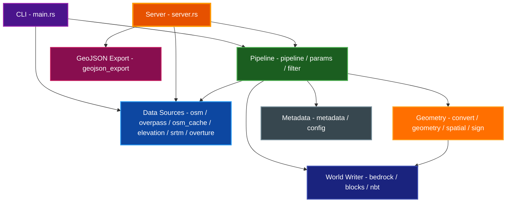
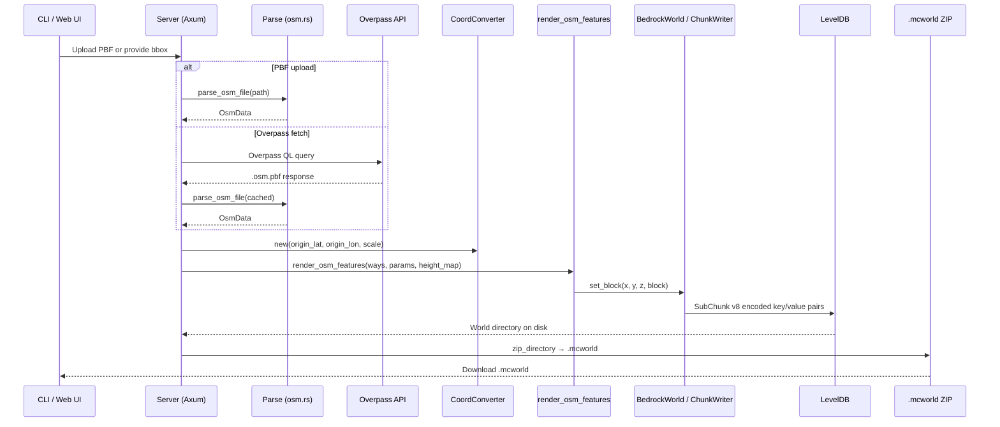
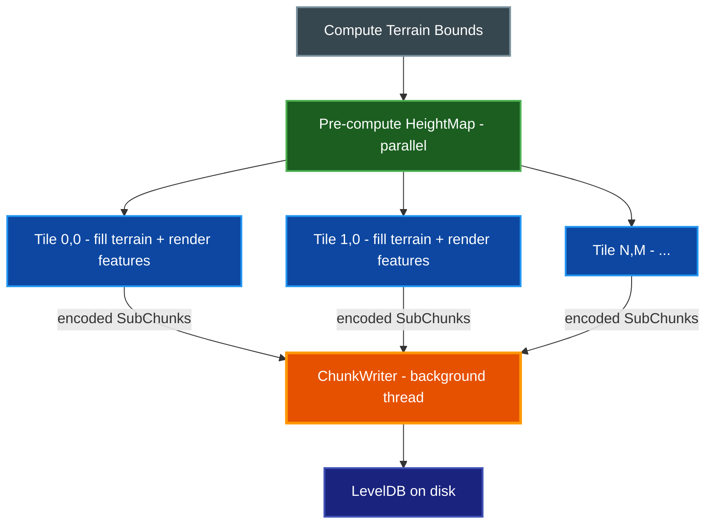

# Architecture

High-level architecture and design of the osm-to-bedrock project, a Rust CLI and web application that converts OpenStreetMap `.osm.pbf` files into playable Minecraft Bedrock Edition worlds backed by LevelDB.

## Table of Contents

- [Overview](#overview)
- [High-Level Pipeline](#high-level-pipeline)
- [Module Map](#module-map)
  - [Module Responsibilities](#module-responsibilities)
  - [Layer Dependencies](#layer-dependencies)
- [Coordinate System](#coordinate-system)
- [Data Flow](#data-flow)
- [Streaming Tile Architecture](#streaming-tile-architecture)
- [World Format Summary](#world-format-summary)
- [Server Architecture](#server-architecture)
  - [API Endpoints](#api-endpoints)
- [Key Design Decisions](#key-design-decisions)
- [Related Documentation](#related-documentation)

## Overview

osm-to-bedrock reads real-world geographic data from OpenStreetMap and produces a Minecraft Bedrock Edition world that you can open on mobile, console, or Windows 10/11. The core conversion pipeline:

1. Parses `.osm.pbf` files (or fetches data from the Overpass API)
2. Projects geographic coordinates onto a Minecraft block grid
3. Maps OSM tags to Minecraft block types
4. Fills terrain layers and overlays geographic features (roads, buildings, water, land use, railways)
5. Writes a LevelDB database in Bedrock's SubChunk v8 format
6. Optionally packages the result as a `.mcworld` ZIP archive for one-tap import

The project ships as both a CLI binary (six subcommands) and an Axum-based HTTP server with a Next.js web frontend.

## High-Level Pipeline

The conversion pipeline has two variants depending on the caller:

- **Streaming (tile-based)** — used by the CLI `convert` subcommand and the server's `/convert`, `/fetch-convert`, and `/terrain-convert` endpoints. Processes the world in fixed-size tiles to bound memory usage.
- **In-memory** — used by the server's `/preview` endpoint. Accumulates all chunks in a single `BedrockWorld` for fast 3D preview generation.

Both variants share the same `render_osm_features` function to avoid code duplication. The only difference is how chunks are flushed: streaming drains each tile to LevelDB before allocating the next; in-memory keeps everything in a single world object.

## Module Map

The library crate (`src/lib.rs`) exposes the following public modules, grouped here by logical layer.

### Module Responsibilities

| Layer | Module | Responsibility |
|-------|--------|----------------|
| **CLI** | `main.rs` (binary) | Clap subcommands: `convert`, `serve`, `parse`, `overpass`, `terrain-convert`, `cache` |
| **Pipeline** | `pipeline` | Orchestrates the full conversion flow (streaming and in-memory variants) |
| **Pipeline** | `params` | `ConvertParams` and `TerrainParams` structs shared by CLI and server |
| **Pipeline** | `filter` | `FeatureFilter` — boolean toggles for roads, buildings, water, land use, railways |
| **Data Sources** | `osm` | Parses `.osm.pbf` and `.osm` XML files into `OsmData` (nodes HashMap + ways Vec) |
| **Data Sources** | `overpass` | Builds Overpass QL queries, fetches from API, writes to disk cache |
| **Data Sources** | `osm_cache` | Disk cache at `~/.cache/osm-to-bedrock/overpass/`; SHA-256 keyed, supports containment lookups |
| **Data Sources** | `overture` | Overture Maps GeoJSON/GeoParquet ingestion |
| **Data Sources** | `elevation` | Loads SRTM HGT tiles, builds height grids, applies to terrain |
| **Data Sources** | `srtm` | SRTM tile download and HGT file parsing |
| **Geometry** | `convert` | `CoordConverter` (lat/lon to block), Bresenham line rasterization, scanline polygon fill |
| **Geometry** | `geometry` | High-level drawing: `draw_road`, `draw_building`, `draw_bridge`, `draw_tunnel`, `draw_waterway`, `draw_roof` |
| **Geometry** | `spatial` | `SpatialIndex` (type-bucketed + grid-indexed way lookup), `HeightMap`, `TILE_CHUNKS` constant |
| **Geometry** | `sign` | Street-name sign formatting, nearest-road vector calculation, sign direction |
| **World Writer** | `bedrock` | `BedrockWorld`, `ChunkData`, `ChunkWriter` — LevelDB database with SubChunk v8 encoding and `level.dat` |
| **World Writer** | `blocks` | `Block` enum (60+ variants), OSM tag-to-block mapping, `RoadStyle`, `WaterwayStyle` |
| **World Writer** | `nbt` | Minimal little-endian NBT writer (Bedrock uses LE, not BE like Java) |
| **Server** | `server` | Axum HTTP API — multipart upload, background job tracking, `.mcworld` download |
| **Server** | `geojson_export` | Converts `OsmData` to GeoJSON `FeatureCollection` for the web frontend |
| **Metadata** | `metadata` | `WorldMetadata` — records conversion parameters, timing, and source info as `world_info.json` |
| **Metadata** | `config` | Runtime configuration and environment variable resolution |

### Layer Dependencies

## Coordinate System

The `CoordConverter` struct in `src/convert.rs` handles all geographic-to-block projection using an equirectangular approximation.

**Projection formula:**

- **Origin**: Center of the OSM data bounding box `(origin_lat, origin_lon)`
- **X axis (East)**: `block_x = (lon - origin_lon) * metres_per_deg_lon / metres_per_block`
- **Z axis (North)**: `block_z = -(lat - origin_lat) * metres_per_deg_lat / metres_per_block`
- The negation on Z maps Minecraft's north (-Z) to geographic north

**Axis conventions:**

| Direction | Minecraft Axis | Sign |
|-----------|---------------|------|
| East | X | +X |
| North | Z | -Z |
| Up | Y | +Y |

**Block storage order**: Blocks within a SubChunk are packed in XZY order — `index = x * 256 + z * 16 + y` — where x, z, and y range from 0 to 15.

**Chunk key format**: LevelDB keys are 9 or 10 bytes:

| Bytes | Content | Purpose |
|-------|---------|---------|
| 0..4 | `chunk_x` (i32 LE) | Chunk X coordinate |
| 4..8 | `chunk_z` (i32 LE) | Chunk Z coordinate |
| 8 | `tag` (u8) | Data type tag |
| 9 | `sy` (u8) | SubChunk Y index (only for tag `0x2f`) |

**Rasterization**: The `convert` module provides Bresenham line rasterization (`rasterize_line`) for roads and edges, and scanline polygon fill (`rasterize_polygon`, `rasterize_polygon_with_holes`) for buildings, land use, and water bodies.

## Data Flow

## Streaming Tile Architecture

For large maps, holding every chunk in memory would be prohibitive. The streaming pipeline in `run_pipeline_streaming` divides the world into square tiles of `TILE_CHUNKS x TILE_CHUNKS` chunks (64 x 64 chunks = 1024 x 1024 blocks per tile).

**How it works:**

1. **Compute terrain bounds** — a fast pass over all OSM nodes to determine the block-coordinate bounding box
2. **Pre-compute global HeightMap** — parallel computation of surface Y for every block column (elevation-aware when SRTM data is present)
3. **Tile iteration** — the chunk bounding box is divided into tiles; each tile is processed independently:
   - Allocate `ChunkData` for every chunk in the tile
   - Fill terrain layers (bedrock, stone, dirt, grass) using Rayon parallel iterators
   - Render OSM features that intersect the tile using spatially-filtered way indices
   - Encode SubChunks and send key/value pairs to the background `ChunkWriter` thread
   - Drop the tile's chunk data before starting the next tile
4. **Background I/O** — `ChunkWriter` owns a dedicated thread that holds the LevelDB `DB` handle. Encoded SubChunk bytes flow over a bounded channel, pipelining CPU encoding with disk writes.

The `SpatialIndex` in `src/spatial.rs` accelerates per-tile queries. Ways are bucketed by type (highway, building, waterway, etc.) and indexed on a 64-block grid, enabling O(way-type) iteration per tile instead of scanning all ways.

## World Format Summary

The Bedrock world format centers on a LevelDB database and a `level.dat` header file.

**SubChunk v8 encoding:**

- Version byte: `0x08`
- Storage count: `1`
- Bits-per-block flags: `(bits << 1) | 0` — the smallest valid size from `[1, 2, 3, 4, 5, 6, 8, 16]` is chosen to fit the palette
- Packed block indices: 4096 entries in XZY order, packed into `u32` LE words
- NBT palette: length-prefixed array of little-endian NBT compounds, one per unique block state

**NBT**: Bedrock uses little-endian NBT (not big-endian like Java Edition). The `nbt` module implements only the subset needed for SubChunk palettes, `level.dat`, and sign block entities.

**level.dat**: Written with an 8-byte header (magic + length) followed by a root NBT compound containing world name, game type, spawn position, and other settings.

> **See** [MINECRAFT_BEDROCK_MAP_FORMAT.md](MINECRAFT_BEDROCK_MAP_FORMAT.md) for the full specification of chunk keys, SubChunk encoding, and LevelDB compressor IDs.

## Server Architecture

The HTTP server in `src/server.rs` uses Axum with Tower middleware. It runs as an async Tokio application and is started via the `serve` subcommand or `make serve`.

**Key architectural elements:**

- **CORS** — configurable allowed origins via `cors_allowed_origin()`, permitting GET, POST, and OPTIONS methods
- **Background jobs** — conversion jobs run in spawned Tokio tasks. Job state is tracked in `Arc<Mutex<HashMap<String, JobState>>>` (the `Jobs` type). A background eviction task periodically removes completed jobs past their TTL.
- **Body limits** — per-route limits prevent abuse: 100 MB for parse, 500 MB for convert, 50 MB for preview
- **ChunkWriter I/O pipeline** — the server uses the same streaming tile architecture as the CLI, so large conversions do not spike memory

### API Endpoints

| Method | Path | Purpose |
|--------|------|---------|
| `GET` | `/health` | Liveness check |
| `POST` | `/parse` | Upload `.osm.pbf`, returns GeoJSON + bounds + stats |
| `POST` | `/convert` | Upload `.osm.pbf` + options JSON, starts background conversion, returns job ID |
| `POST` | `/preview` | Upload `.osm.pbf`, returns 3D block preview data |
| `POST` | `/fetch-preview` | Fetch from Overpass and return preview |
| `POST` | `/fetch-block-preview` | Fetch from Overpass and return block-level preview |
| `POST` | `/fetch-convert` | Fetch from Overpass + convert in one step |
| `POST` | `/terrain-convert` | SRTM-only world (no OSM features) |
| `POST` | `/overture-convert` | Overture Maps data conversion |
| `GET` | `/cache/areas` | List cached Overpass bbox entries |
| `GET` | `/status/{id}` | Poll conversion job progress |
| `GET` | `/download/{id}` | Download completed `.mcworld` file |

The Next.js frontend (`web/`) proxies all backend calls through its own API routes (`web/src/app/api/`) to the Rust server. The Rust API base URL is configured via `NEXT_PUBLIC_API_URL`.

## Key Design Decisions

| Decision | Rationale |
|----------|-----------|
| **Flat world at configurable sea-level** | Default Y=65; real elevation available via `--elevation` with SRTM data. Keeps the default simple and fast. |
| **Equirectangular projection** | Accurate enough at city scale, computationally cheap — just multiplication and a cosine correction for longitude. |
| **Smallest-valid bits-per-block** | SubChunk palette encoding picks the minimum from `[1, 2, 3, 4, 5, 6, 8, 16]` bits to fit the number of unique block states, minimizing file size. |
| **Mojang-compatible LevelDB compressors** | Registers compressor IDs 0 (none), 2 (zlib), and 4 (raw deflate) so Bedrock can read the database. Modern worlds default to ID 4. |
| **Disk cache with SHA-256 keys** | Overpass responses are cached at `~/.cache/osm-to-bedrock/overpass/`. The key is SHA-256 of the snapped bbox (4 decimal places) + feature filter. Containment lookups reuse a larger cached area rather than re-fetching. |
| **Tile-based streaming** | 64x64 chunk tiles keep peak memory proportional to tile size rather than total map area, enabling city-scale conversions on modest hardware. |
| **Background ChunkWriter thread** | Separates CPU-bound SubChunk encoding from disk-bound LevelDB writes via a bounded channel, improving throughput. |
| **Shared render_osm_features** | Both streaming and in-memory pipelines call the same rendering function, eliminating code duplication between CLI and preview paths. |
| **Progress callback** | `run_conversion` accepts a `progress_cb: &dyn Fn(f32, &str)` callback used by both CLI (terminal output) and server (job status polling). |

## Related Documentation

- [CLI.md](CLI.md) — Complete CLI flag reference and usage examples
- [MINECRAFT_BEDROCK_MAP_FORMAT.md](MINECRAFT_BEDROCK_MAP_FORMAT.md) — Full Bedrock world format specification
- [MINECRAFT_BEDROCK_TOOLS_AND_IMPORT.md](MINECRAFT_BEDROCK_TOOLS_AND_IMPORT.md) — Tools and import workflow
- [DEVELOPER_INFO.md](DEVELOPER_INFO.md) — Development setup and contribution guide
- [README.md](README.md) — Documentation index
