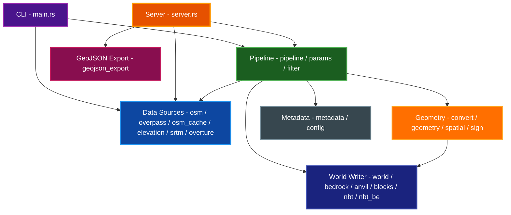
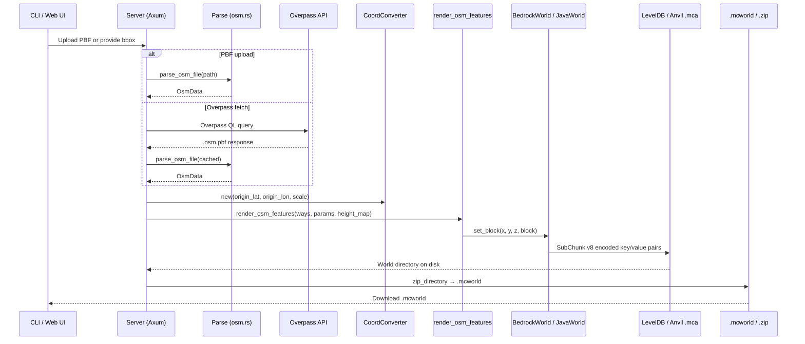
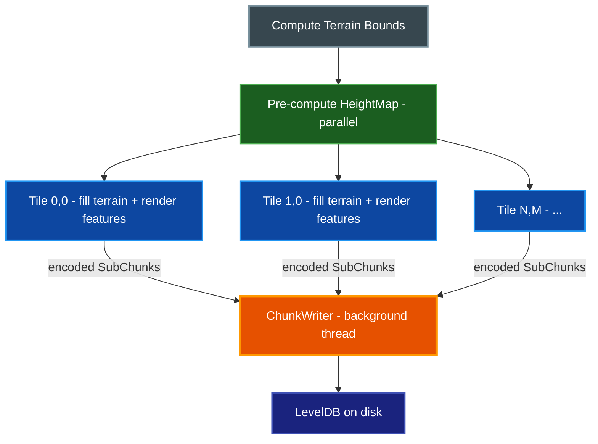

# Architecture

High-level architecture and design of the osm-to-bedrock project, a Rust CLI and web application that converts OpenStreetMap `.osm.pbf` files into playable Minecraft Bedrock Edition or Java Edition worlds.

## Table of Contents

- [Overview](#overview)
- [High-Level Pipeline](#high-level-pipeline)
- [Module Map](#module-map)
  - [Module Responsibilities](#module-responsibilities)
  - [Layer Dependencies](#layer-dependencies)
- [Coordinate System](#coordinate-system)
- [Data Flow](#data-flow)
- [Streaming Tile Architecture](#streaming-tile-architecture)
- [World Format Summary](#world-format-summary)
- [Server Architecture](#server-architecture)
  - [API Endpoints](#api-endpoints)
- [Key Design Decisions](#key-design-decisions)
- [Related Documentation](#related-documentation)

## Overview

osm-to-bedrock reads real-world geographic data from OpenStreetMap and produces a Minecraft world that you can open on mobile, console, Windows 10/11 (Bedrock Edition), or desktop (Java Edition 1.18+). The core conversion pipeline:

1. Parses `.osm.pbf` files (or fetches data from the Overpass API)
2. Projects geographic coordinates onto a Minecraft block grid
3. Maps OSM tags to Minecraft block types
4. Fills terrain layers and overlays geographic features (roads, buildings, water, land use, railways)
5. Writes a LevelDB database in Bedrock's SubChunk v8 format
6. Optionally packages the result as a `.mcworld` ZIP archive for one-tap import

The project ships as both a CLI binary (six subcommands) and an Axum-based HTTP server with a Next.js web frontend.

## High-Level Pipeline

The conversion pipeline has two variants depending on the caller:

- **Streaming (tile-based)** — used by the CLI `convert` subcommand and the server's `/convert`, `/fetch-convert`, and `/terrain-convert` endpoints. Processes the world in fixed-size tiles to bound memory usage.
- **In-memory** — used by the server's `/preview` endpoint. Accumulates all chunks in a single `Box<dyn WorldWriter>` for fast 3D preview generation.

Both variants share the same `render_osm_features` function to avoid code duplication. The pipeline is edition-agnostic: it targets the `WorldWriter` trait, with `BedrockWorld` (LevelDB) and `JavaWorld` (Anvil region files) as concrete backends selected via the `--edition` flag.

```mermaid
graph LR
    Parse[Parse PBF / Fetch Overpass]
    Convert[Convert Coordinates]
    Map[Map Tags to Blocks]
    Terrain[Build Terrain Layers]
    Overlay[Overlay OSM Features]
    Write[Write LevelDB]
    Zip[Package .mcworld]

    Parse --> Convert
    Convert --> Map
    Map --> Terrain
    Terrain --> Overlay
    Overlay --> Write
    Write --> Zip

    style Parse fill:#e65100,stroke:#ff9800,stroke-width:3px,color:#ffffff
    style Convert fill:#1b5e20,stroke:#4caf50,stroke-width:2px,color:#ffffff
    style Map fill:#0d47a1,stroke:#2196f3,stroke-width:2px,color:#ffffff
    style Terrain fill:#1a237e,stroke:#3f51b5,stroke-width:2px,color:#ffffff
    style Overlay fill:#4a148c,stroke:#9c27b0,stroke-width:2px,color:#ffffff
    style Write fill:#880e4f,stroke:#c2185b,stroke-width:2px,color:#ffffff
    style Zip fill:#37474f,stroke:#78909c,stroke-width:2px,color:#ffffff
```

## Module Map

The library crate (`src/lib.rs`) exposes the following public modules, grouped here by logical layer.

### Module Responsibilities

| Layer | Module | Responsibility |
|-------|--------|----------------|
| **CLI** | `main.rs` (binary) | Clap subcommands: `convert`, `serve`, `parse`, `overpass`, `terrain-convert`, `cache` |
| **Pipeline** | `pipeline` | Orchestrates the full conversion flow (streaming and in-memory variants) |
| **Pipeline** | `params` | `ConvertParams` and `TerrainParams` structs shared by CLI and server |
| **Pipeline** | `filter` | `FeatureFilter` — boolean toggles for roads, buildings, water, land use, railways |
| **Pipeline** | `world` | `WorldWriter` trait, `Edition` enum, `ChunkData` — shared abstraction over Bedrock and Java backends |
| **Data Sources** | `osm` | Parses `.osm.pbf` and `.osm` XML files into `OsmData` (nodes HashMap + ways Vec) |
| **Data Sources** | `overpass` | Builds Overpass QL queries, fetches from API, writes to disk cache |
| **Data Sources** | `osm_cache` | Disk cache at `~/.cache/osm-to-bedrock/overpass/`; SHA-256 keyed, supports containment lookups |
| **Data Sources** | `overture` | Overture Maps GeoJSON/GeoParquet ingestion |
| **Data Sources** | `elevation` | Loads SRTM HGT tiles, builds height grids, applies to terrain |
| **Data Sources** | `srtm` | SRTM tile download and HGT file parsing |
| **Geometry** | `convert` | `CoordConverter` (lat/lon to block), Bresenham line rasterization, scanline polygon fill |
| **Geometry** | `geometry` | High-level drawing: `draw_road`, `draw_building`, `draw_bridge`, `draw_tunnel`, `draw_waterway`, `draw_roof` |
| **Geometry** | `spatial` | `SpatialIndex` (type-bucketed + grid-indexed way lookup), `HeightMap`, `TILE_CHUNKS` constant |
| **Geometry** | `sign` | Street-name sign formatting, nearest-road vector calculation, sign direction |
| **World Writer** | `bedrock` | `BedrockWorld`, `ChunkWriter` — LevelDB database with SubChunk v8 encoding and `level.dat` |
| **World Writer** | `anvil` | `JavaWorld` — Anvil region file writer (`.mca`), Java `level.dat`, session.lock |
| **World Writer** | `blocks` | `Block` enum (60+ variants), OSM tag-to-block mapping, `RoadStyle`, `WaterwayStyle` |
| **World Writer** | `nbt` | Minimal little-endian NBT writer (Bedrock uses LE, not BE like Java) |
| **World Writer** | `nbt_be` | Big-endian NBT writer for Java Edition (TAG_LIST, TAG_LONG_ARRAY, etc.) |
| **Server** | `server` | Axum HTTP API — multipart upload, background job tracking, `.mcworld` download |
| **Server** | `geojson_export` | Converts `OsmData` to GeoJSON `FeatureCollection` for the web frontend |
| **Metadata** | `metadata` | `WorldMetadata` — records conversion parameters, timing, and source info as `world_info.json` |
| **Metadata** | `config` | Runtime configuration and environment variable resolution |

### Layer Dependencies

```mermaid
graph TD
    CLI[CLI - main.rs]
    Server[Server - server.rs]
    Pipeline[Pipeline - pipeline / params / filter]
    DataSources[Data Sources - osm / overpass / osm_cache / elevation / srtm / overture]
    Geometry[Geometry - convert / geometry / spatial / sign]
    WorldWriter[World Writer - world / bedrock / anvil / blocks / nbt / nbt_be]
    GeoJSON[GeoJSON Export - geojson_export]
    Metadata[Metadata - metadata / config]

    CLI --> Pipeline
    CLI --> DataSources
    Server --> Pipeline
    Server --> DataSources
    Server --> GeoJSON
    Pipeline --> DataSources
    Pipeline --> Geometry
    Pipeline --> WorldWriter
    Pipeline --> Metadata
    Geometry --> WorldWriter

    style CLI fill:#4a148c,stroke:#9c27b0,stroke-width:2px,color:#ffffff
    style Server fill:#e65100,stroke:#ff9800,stroke-width:3px,color:#ffffff
    style Pipeline fill:#1b5e20,stroke:#4caf50,stroke-width:2px,color:#ffffff
    style DataSources fill:#0d47a1,stroke:#2196f3,stroke-width:2px,color:#ffffff
    style Geometry fill:#ff6f00,stroke:#ffa726,stroke-width:2px,color:#ffffff
    style WorldWriter fill:#1a237e,stroke:#3f51b5,stroke-width:2px,color:#ffffff
    style GeoJSON fill:#880e4f,stroke:#c2185b,stroke-width:2px,color:#ffffff
    style Metadata fill:#37474f,stroke:#78909c,stroke-width:2px,color:#ffffff
```

## Coordinate System

The `CoordConverter` struct in `src/convert.rs` handles all geographic-to-block projection using an equirectangular approximation.

**Projection formula:**

- **Origin**: Center of the OSM data bounding box `(origin_lat, origin_lon)`
- **X axis (East)**: `block_x = (lon - origin_lon) * metres_per_deg_lon / metres_per_block`
- **Z axis (North)**: `block_z = -(lat - origin_lat) * metres_per_deg_lat / metres_per_block`
- The negation on Z maps Minecraft's north (-Z) to geographic north

**Axis conventions:**

| Direction | Minecraft Axis | Sign |
|-----------|---------------|------|
| East | X | +X |
| North | Z | -Z |
| Up | Y | +Y |

**Block storage order**: Blocks within a SubChunk are packed in XZY order — `index = x * 256 + z * 16 + y` — where x, z, and y range from 0 to 15.

**Chunk key format**: LevelDB keys are 9 or 10 bytes:

| Bytes | Content | Purpose |
|-------|---------|---------|
| 0..4 | `chunk_x` (i32 LE) | Chunk X coordinate |
| 4..8 | `chunk_z` (i32 LE) | Chunk Z coordinate |
| 8 | `tag` (u8) | Data type tag |
| 9 | `sy` (u8) | SubChunk Y index (only for tag `0x2f`) |

**Rasterization**: The `convert` module provides Bresenham line rasterization (`rasterize_line`) for roads and edges, and scanline polygon fill (`rasterize_polygon`, `rasterize_polygon_with_holes`) for buildings, land use, and water bodies.

## Data Flow

```mermaid
sequenceDiagram
    participant User as CLI / Web UI
    participant Server as Server (Axum)
    participant Parse as Parse (osm.rs)
    participant Overpass as Overpass API
    participant Conv as CoordConverter
    participant Render as render_osm_features
    participant BW as BedrockWorld / JavaWorld
    participant LDB as LevelDB / Anvil .mca
    participant ZIP as .mcworld / .zip

    User->>Server: Upload PBF or provide bbox
    alt PBF upload
        Server->>Parse: parse_osm_file(path)
        Parse-->>Server: OsmData
    else Overpass fetch
        Server->>Overpass: Overpass QL query
        Overpass-->>Server: .osm.pbf response
        Server->>Parse: parse_osm_file(cached)
        Parse-->>Server: OsmData
    end
    Server->>Conv: new(origin_lat, origin_lon, scale)
    Server->>Render: render_osm_features(ways, params, height_map)
    Render->>BW: set_block(x, y, z, block)
    BW->>LDB: SubChunk v8 encoded key/value pairs
    LDB-->>Server: World directory on disk
    Server->>ZIP: zip_directory → .mcworld
    ZIP-->>User: Download .mcworld
```

## Streaming Tile Architecture

For large maps, holding every chunk in memory would be prohibitive. The streaming pipeline in `run_pipeline_streaming` divides the world into square tiles of `TILE_CHUNKS x TILE_CHUNKS` chunks (64 x 64 chunks = 1024 x 1024 blocks per tile).

The pipeline is **edition-agnostic at the outer tile loop**: it constructs one persistent `Box<dyn WorldWriter>` for the whole run, then for each tile calls `world.set_tile_bounds(...)` to scope writes, `process_tile(...)` to fill terrain + render features, and `world.flush_tile()` to drain the tile's state to the edition-specific sink.

- **Bedrock** (`BedrockWorld::new_streaming`) owns a background `ChunkWriter` thread. `set_tile_bounds` scopes `set_block` writes to the tile; `flush_tile` encodes the tile's SubChunks, ships them over a bounded channel to the writer thread, and clears the in-memory chunk map. Peak memory stays bounded to one tile's worth of `ChunkData` regardless of total map size.
- **Java** does not yet have a streaming Anvil writer. `set_tile_bounds` is a no-op, `flush_tile` is a no-op, and chunks accumulate in `JavaWorld::chunks` for the whole run. To prevent city-scale `edition=java` conversions from OOM-killing the process, the pipeline calls `world::enforce_java_memory_budget(chunk_count)` up front and refuses oversized Java conversions with a clear error (see ARC-001 in `AUDIT.md`). A streaming Anvil writer that lets Java match Bedrock's per-tile memory profile is future work.

**How it works:**

1. **Compute terrain bounds** — a fast pass over all OSM nodes to determine the block-coordinate bounding box
2. **Java memory guard (ARC-001)** — refuse oversized `edition=java` conversions before any allocation if the estimated chunk count exceeds the ~1.5 GB in-memory budget
3. **Pre-compute global HeightMap** — parallel computation of surface Y for every block column (elevation-aware when SRTM data is present)
4. **Tile iteration** — the chunk bounding box is divided into tiles; each tile is processed independently:
   - `set_tile_bounds` scopes writes to the tile's chunk rectangle
   - Allocate `ChunkData` for every chunk in the tile
   - Fill terrain layers (bedrock, stone, dirt, grass) using Rayon parallel iterators
   - Render OSM features that intersect the tile using spatially-filtered way indices
   - `flush_tile` ships encoded SubChunks to the background `ChunkWriter` thread (Bedrock) and clears the tile's in-memory state; no-op for Java, which retains the chunks for the final region-file write
5. **Background I/O** — `ChunkWriter` owns a dedicated thread that holds the LevelDB `DB` handle. Encoded SubChunk bytes flow over a bounded channel, pipelining CPU encoding with disk writes.

```mermaid
graph TD
    Bounds[Compute Terrain Bounds]
    HM[Pre-compute HeightMap - parallel]
    Tile1[Tile 0,0 - fill terrain + render features]
    Tile2[Tile 1,0 - fill terrain + render features]
    TileN[Tile N,M - ...]
    CW[ChunkWriter - background thread]
    LDB[LevelDB on disk]

    Bounds --> HM
    HM --> Tile1
    HM --> Tile2
    HM --> TileN
    Tile1 -->|encoded SubChunks| CW
    Tile2 -->|encoded SubChunks| CW
    TileN -->|encoded SubChunks| CW
    CW --> LDB

    style Bounds fill:#37474f,stroke:#78909c,stroke-width:2px,color:#ffffff
    style HM fill:#1b5e20,stroke:#4caf50,stroke-width:2px,color:#ffffff
    style Tile1 fill:#0d47a1,stroke:#2196f3,stroke-width:2px,color:#ffffff
    style Tile2 fill:#0d47a1,stroke:#2196f3,stroke-width:2px,color:#ffffff
    style TileN fill:#0d47a1,stroke:#2196f3,stroke-width:2px,color:#ffffff
    style CW fill:#e65100,stroke:#ff9800,stroke-width:3px,color:#ffffff
    style LDB fill:#1a237e,stroke:#3f51b5,stroke-width:2px,color:#ffffff
```

The `SpatialIndex` in `src/spatial.rs` accelerates per-tile queries. Ways are bucketed by type (highway, building, waterway, etc.) and indexed on a 64-block grid, enabling O(way-type) iteration per tile instead of scanning all ways.

## World Format Summary

The pipeline supports two output formats, selected via `--edition`:

### Bedrock Edition

The Bedrock world format centers on a LevelDB database and a `level.dat` header file.

**SubChunk v8 encoding:**

- Version byte: `0x08`
- Storage count: `1`
- Bits-per-block flags: `(bits << 1) | 0` — the smallest valid size from `[1, 2, 3, 4, 5, 6, 8, 16]` is chosen to fit the palette
- Packed block indices: 4096 entries in XZY order, packed into `u32` LE words
- NBT palette: length-prefixed array of little-endian NBT compounds, one per unique block state

**NBT**: Bedrock uses little-endian NBT (not big-endian like Java Edition). The `nbt` module implements only the subset needed for SubChunk palettes, `level.dat`, and sign block entities.

**level.dat**: Written with an 8-byte header (magic + length) followed by a root NBT compound containing world name, game type, spawn position, and other settings.

> **See** [MINECRAFT_BEDROCK_MAP_FORMAT.md](MINECRAFT_BEDROCK_MAP_FORMAT.md) for the full specification of chunk keys, SubChunk encoding, and LevelDB compressor IDs.

### Java Edition

The Java world format uses Anvil region files (`.mca`) and a gzip-compressed `level.dat`.

**Region file layout** (`region/r.X.Z.mca`):
- 8KB header: 4KB location table (3-byte sector offset + 1-byte count per chunk) + 4KB timestamp table
- Per-chunk: 4-byte BE length + 1-byte compression type (0x02 = zlib) + zlib-compressed big-endian NBT
- Each file covers 32×32 chunks

**Chunk NBT** (1.18+ data-driven format):
- `DataVersion`: 3465 (1.21.x)
- `sections`: list of 16×16×16 sections, each with `block_states` (palette + packed long array) and `biomes` (string palette)
- Block state packing: indices packed into 64-bit longs, max(4, ceil(log2(palette_size))) bits per entry
- Biomes: string IDs (e.g. `minecraft:plains`) in a simplified per-section palette

**NBT**: Java uses big-endian NBT. The `nbt_be` module implements the writer with additional tag types (`TAG_LIST`, `TAG_LONG_ARRAY`, `TAG_INT_ARRAY`) needed by the Anvil format.

**level.dat**: gzip-compressed big-endian NBT with `DataVersion`, `Version.Name`, `GameType`, spawn position, and `WorldGenSettings`.

## Server Architecture

The HTTP server lives in the `src/server/` module (split across `mod.rs`, `state.rs`, `auth.rs`, `options.rs`, `error.rs`, and `handlers.rs`), uses Axum with Tower middleware, and runs as an async Tokio application. It is started via the `serve` subcommand or `make serve`. The router is assembled in `build_router_with_state` in `src/server/mod.rs`.

**Key architectural elements:**

- **CORS** — configurable allowed origins via `cors_allowed_origin()`, permitting GET, POST, and OPTIONS methods
- **Background jobs** — conversion jobs run in spawned Tokio tasks. Job state is tracked in `Arc<Mutex<HashMap<String, JobState>>>` (the `Jobs` type). A background eviction task periodically removes completed jobs past their TTL.
- **Body limits** — per-route limits prevent abuse: 100 MB for parse, 500 MB for convert, 50 MB for preview, and 1 MiB for the JSON routes (`fetch-preview`, `fetch-block-preview`, `fetch-convert`, `terrain-convert`, `overture-convert`)
- **Auth** — when `OSM_TO_BEDROCK_API_KEY` is set, every route except `/health` requires the matching key in the `Authorization` (or `X-API-Key`) header. `/health` stays public so liveness probes work without credentials.
- **ChunkWriter I/O pipeline** — the server uses the same streaming tile architecture as the CLI, so large conversions do not spike memory

### API Endpoints

| Method | Path | Purpose |
|--------|------|---------|
| `GET` | `/health` | Liveness check |
| `POST` | `/parse` | Upload `.osm.pbf`, returns GeoJSON + bounds + stats |
| `POST` | `/convert` | Upload `.osm.pbf` + options JSON, starts background conversion, returns job ID |
| `POST` | `/preview` | Upload `.osm.pbf`, returns 3D block preview data |
| `POST` | `/fetch-preview` | Fetch from Overpass and return preview |
| `POST` | `/fetch-block-preview` | Fetch from Overpass and return block-level preview |
| `POST` | `/fetch-convert` | Fetch from Overpass + convert in one step |
| `POST` | `/terrain-convert` | SRTM-only world (no OSM features) |
| `POST` | `/overture-convert` | Overture Maps data conversion |
| `GET` | `/cache/areas` | List cached Overpass bbox entries |
| `GET` | `/status/{id}` | Poll conversion job progress |
| `GET` | `/download/{id}` | Download completed `.mcworld` (Bedrock) or `.zip` (Java) file |

All routes except `/health` require the API key when one is configured (see Auth above). The Next.js frontend (`web/`) proxies all backend calls through its own API routes (`web/src/app/api/`) to the Rust server. The Rust API base URL is configured via the server-side `RUST_API_URL` env var (default `http://localhost:3002`); it is not `NEXT_PUBLIC_`-prefixed, so it is never inlined into the browser bundle and can be overridden at runtime without a rebuild.

## Key Design Decisions

| Decision | Rationale |
|----------|-----------|
| **Flat world at configurable sea-level** | Default Y=65; real elevation available via `--elevation` with SRTM data. Keeps the default simple and fast. |
| **Equirectangular projection** | Accurate enough at city scale, computationally cheap — just multiplication and a cosine correction for longitude. |
| **Smallest-valid bits-per-block** | SubChunk palette encoding picks the minimum from `[1, 2, 3, 4, 5, 6, 8, 16]` bits to fit the number of unique block states, minimizing file size. |
| **Mojang-compatible LevelDB compressors** | Registers compressor IDs 0 (none), 2 (zlib), and 4 (raw deflate) so Bedrock can read the database. Modern worlds default to ID 4. |
| **Disk cache with SHA-256 keys** | Overpass responses are cached at `~/.cache/osm-to-bedrock/overpass/`. The key is SHA-256 of the snapped bbox (4 decimal places) + feature filter. Containment lookups reuse a larger cached area rather than re-fetching. |
| **Tile-based streaming** | 64x64 chunk tiles keep peak memory proportional to tile size rather than total map area, enabling city-scale conversions on modest hardware. |
| **Background ChunkWriter thread** | Separates CPU-bound SubChunk encoding from disk-bound LevelDB writes via a bounded channel, improving throughput. |
| **Shared render_osm_features** | Both streaming and in-memory pipelines call the same rendering function, eliminating code duplication between CLI and preview paths. |
| **Progress callback** | `run_conversion` accepts a `progress_cb: &dyn Fn(f32, &str)` callback used by both CLI (terminal output) and server (job status polling). |

## Related Documentation

- [CLI.md](CLI.md) — Complete CLI flag reference and usage examples
- [MINECRAFT_BEDROCK_MAP_FORMAT.md](MINECRAFT_BEDROCK_MAP_FORMAT.md) — Full Bedrock world format specification
- [MINECRAFT_BEDROCK_TOOLS_AND_IMPORT.md](MINECRAFT_BEDROCK_TOOLS_AND_IMPORT.md) — Tools and import workflow
- [DEVELOPER_INFO.md](DEVELOPER_INFO.md) — Development setup and contribution guide
- [README.md](README.md) — Documentation index
