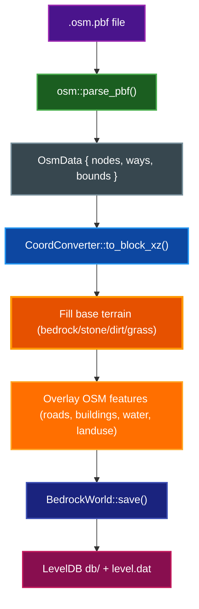
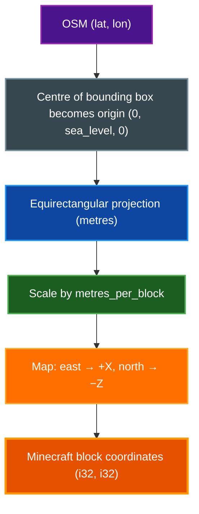

# OSM to Bedrock — Developer Documentation

Comprehensive reference for the `osm_to_bedrock` Rust project: architecture, module design,
coordinate systems, block mapping, and development guide.

## Table of Contents

- [Project Overview](#project-overview)
- [Architecture Overview](#architecture-overview)
  - [Pipeline Stages](#pipeline-stages)
  - [Module Tree](#module-tree)
  - [Data Flow Diagram](#data-flow-diagram)
- [Module Documentation](#module-documentation)
  - [osm — OpenStreetMap Parser](#osm--openstreetmap-parser)
  - [convert — Coordinate Transformation and Rasterization](#convert--coordinate-transformation-and-rasterization)
  - [blocks — Block Type Definitions and Mappings](#blocks--block-type-definitions-and-mappings)
  - [bedrock — Bedrock Format Writer](#bedrock--bedrock-format-writer)
  - [nbt — Little-Endian NBT Writer](#nbt--little-endian-nbt-writer)
  - [main — CLI and Orchestration](#main--cli-and-orchestration)
  - [server — HTTP API Server](#server--http-api-server)
  - [elevation and srtm — Terrain Elevation](#elevation-and-srtm--terrain-elevation)
  - [geojson\_export — GeoJSON Export](#geojson_export--geojson-export)
  - [overpass and osm\_cache — Overpass Client and Cache](#overpass-and-osm_cache--overpass-client-and-cache)
  - [filter — Feature Flags](#filter--feature-flags)
  - [config — YAML Configuration File](#config--yaml-configuration-file)
  - [overture — Overture Maps Integration](#overture--overture-maps-integration)
  - [metadata — World Metadata Writer](#metadata--world-metadata-writer)
- [Coordinate System Explanation](#coordinate-system-explanation)
  - [WGS84 Geographic Coordinates](#wgs84-geographic-coordinates)
  - [Equirectangular Approximation](#equirectangular-approximation)
  - [Minecraft Coordinate Space](#minecraft-coordinate-space)
  - [Chunk and SubChunk Coordinates](#chunk-and-subchunk-coordinates)
  - [Full Transformation Pipeline](#full-transformation-pipeline)
- [Block Mapping Reference](#block-mapping-reference)
  - [OSM Tag Priority](#osm-tag-priority)
  - [Roads and Paths](#roads-and-paths)
  - [Waterways](#waterways)
  - [Buildings](#buildings)
  - [Natural Water Bodies](#natural-water-bodies)
  - [Natural Features](#natural-features)
  - [Landuse Areas](#landuse-areas)
  - [Block State Encoding](#block-state-encoding)
- [Bedrock World Format Reference](#bedrock-world-format-reference)
  - [World Directory Structure](#world-directory-structure)
  - [LevelDB Key Schema](#leveldb-key-schema)
  - [SubChunk Encoding](#subchunk-encoding)
  - [level.dat Fields](#leveldat-fields)
- [Usage Examples](#usage-examples)
  - [Basic Conversion](#basic-conversion)
  - [Scale and Height Options](#scale-and-height-options)
  - [Custom Origin](#custom-origin)
  - [Overpass Fetch](#overpass-fetch)
- [Environment Variables](#environment-variables)
- [Web Frontend Architecture](#web-frontend-architecture)
  - [Component Map](#component-map)
  - [Proxy Route Table](#proxy-route-table)
  - [State Flow](#state-flow)
  - [Development](#development)
- [Development Guide](#development-guide)
  - [Prerequisites](#prerequisites)
  - [Building the Project](#building-the-project)
  - [Running Tests](#running-tests)
  - [Makefile Targets](#makefile-targets)
  - [Adding a New Block Mapping](#adding-a-new-block-mapping)
  - [Adding a New OSM Feature Type](#adding-a-new-osm-feature-type)
  - [Debugging Tips](#debugging-tips)
- [Key Design Decisions](#key-design-decisions)
- [Further Reading](#further-reading)

---

## Project Overview

`osm_to_bedrock` converts **OpenStreetMap (OSM)** geographic data into playable
**Minecraft Bedrock Edition** worlds. Given an OSM export (`.osm.pbf` binary format),
the tool:

1. Parses nodes and ways from the PBF dataset
2. Projects geographic coordinates (WGS84 lat/lon) into Minecraft block space using an equirectangular approximation
3. Maps OSM feature tags to Minecraft block types
4. Serialises the result as a Bedrock LevelDB world ready to import into Minecraft

The output is a world folder that can be opened directly on any platform that supports
Minecraft Bedrock Edition: Windows, Android, iOS, Xbox, and Nintendo Switch.

---

## Architecture Overview

### Pipeline Stages


### Module Tree

```
osm_to_bedrock/
├── Cargo.toml
├── Makefile
├── src/
│   ├── main.rs           # CLI entry point (clap subcommands), wires pipeline
│   ├── config.rs         # YAML config file loading, merging, and dumping
│   ├── params.rs         # ConvertParams, TerrainParams — shared parameter structs
│   ├── pipeline.rs       # run_conversion(), run_terrain_only_to_disk() entry points
│   ├── geometry.rs       # draw_road, draw_building, draw_waterway, draw_bridge, draw_tunnel
│   ├── spatial.rs        # SpatialIndex, HeightMap
│   ├── sign.rs           # format_sign_text(), nearest-road-vector helpers
│   ├── osm.rs            # PBF parser — nodes, ways, bounding box
│   ├── convert.rs        # CoordConverter, Bresenham line, scanline polygon fill
│   ├── blocks.rs         # Block enum, OSM tag → block mapping functions
│   ├── bedrock.rs        # ChunkData, BedrockWorld, LevelDB writer, SubChunk encoder
│   ├── nbt.rs            # Minimal little-endian NBT writer
│   ├── server.rs         # Axum HTTP API — multipart upload, conversion jobs, download
│   ├── elevation.rs      # Elevation sampling interface (SRTM + fallback)
│   ├── srtm.rs           # SRTM HGT file reader and bilinear interpolation
│   ├── geojson_export.rs # OsmData → GeoJSON FeatureCollection for the web frontend
│   ├── overpass.rs       # Overpass API client and query builder
│   ├── osm_cache.rs      # Disk-backed Overpass response cache (SHA-256 keyed)
│   ├── overture.rs       # Overture Maps CLI integration — fetch GeoJSON and merge into OsmData
│   ├── metadata.rs       # WorldMetadata — writes world_info.json after conversion
│   ├── lib.rs            # Library crate root — re-exports public API for use as a dependency
│   └── filter.rs         # Feature-type enable/disable flags (roads, buildings, etc.)
├── web/                  # Next.js Web Explorer (see Web Frontend Architecture below)
└── docs/
    ├── README.md
    ├── DEVELOPER_INFO.md
    ├── DOCUMENTATION_STYLE_GUIDE.md
    ├── MINECRAFT_BEDROCK_MAP_FORMAT.md
    └── MINECRAFT_BEDROCK_TOOLS_AND_IMPORT.md
```

### Data Flow Diagram



---

## Module Documentation

### osm — OpenStreetMap Parser

**Purpose:** Parse a `.osm.pbf` file into an in-memory collection of nodes and ways.

#### Key Types

```rust
/// A geographic point from the OSM dataset.
pub struct OsmNode {
    pub lat: f64,
    pub lon: f64,
}

/// An OSM way: an ordered sequence of node references with tags.
pub struct OsmWay {
    pub tags: HashMap<String, String>,
    pub node_refs: Vec<i64>,
}

/// A geographic point that carries feature tags (amenity, shop, tourism, etc.).
/// Used for POI marker placement.
pub struct OsmPoiNode {
    pub lat: f64,
    pub lon: f64,
    pub tags: HashMap<String, String>,
}

/// A member of an OSM relation with its role.
pub struct RelationMember {
    pub way_id: i64,
    pub role: String,
}

/// An OSM relation: a collection of ways with roles and tags.
pub struct OsmRelation {
    pub tags: HashMap<String, String>,
    pub members: Vec<RelationMember>,
}

/// Parsed OSM dataset.
pub struct OsmData {
    pub nodes: HashMap<i64, OsmNode>,
    pub ways: Vec<OsmWay>,
    /// Way lookup by ID for relation member resolution.
    pub ways_by_id: HashMap<i64, usize>,
    /// Multipolygon relations.
    pub relations: Vec<OsmRelation>,
    /// Bounding box: (min_lat, min_lon, max_lat, max_lon)
    pub bounds: Option<(f64, f64, f64, f64)>,
    /// Standalone nodes with POI tags (amenity, shop, tourism, leisure, historic).
    pub poi_nodes: Vec<OsmPoiNode>,
    /// Standalone nodes with address tags (addr:housenumber).
    pub addr_nodes: Vec<OsmPoiNode>,
    /// Individual tree positions (from OSM natural=tree or Overture land/tree).
    pub tree_nodes: Vec<OsmNode>,
}
```

#### Parser Function

```rust
/// Parse a .osm.pbf file and return all nodes and ways.
pub fn parse_pbf(path: &Path) -> Result<OsmData>;
```

The parser handles both `Node` and `DenseNode` PBF elements. It computes a bounding box from
all parsed nodes. Relations are parsed for multipolygon support. Standalone POI nodes (with
amenity, shop, tourism, leisure, or historic tags) and address nodes are collected separately
for marker and label placement.

#### Supported Input Formats

| Format | Extension | Notes |
|--------|-----------|-------|
| OSM PBF | `.osm.pbf` | Binary format; supported via the `osmpbf` crate |

---

### convert — Coordinate Transformation and Rasterization

**Purpose:** Convert WGS84 latitude/longitude pairs to integer Minecraft block coordinates,
and provide rasterization utilities for lines and polygons.

#### CoordConverter

```rust
/// Converts OSM geographic coordinates to Minecraft block coordinates.
///
/// * East  → +X
/// * North → −Z  (Minecraft's north is −Z)
/// * Scale: metres_per_block controls map zoom
pub struct CoordConverter {
    pub origin_lat: f64,
    pub origin_lon: f64,
    pub metres_per_block: f64,
}

impl CoordConverter {
    pub fn new(origin_lat: f64, origin_lon: f64, metres_per_block: f64) -> Self;

    /// Convert (lat, lon) to (block_x, block_z).
    pub fn to_block_xz(&self, lat: f64, lon: f64) -> (i32, i32);

    /// Convert (block_x, block_z) back to (lat, lon).
    /// Inverse of to_block_xz. Used by elevation sampling.
    pub fn to_lat_lon(&self, bx: i32, bz: i32) -> (f64, f64);

    /// Return the (chunk_x, chunk_z) that contains a block coordinate.
    pub fn block_to_chunk(x: i32, z: i32) -> (i32, i32);

    /// Return local (0..16) coordinates within a chunk.
    pub fn local_in_chunk(x: i32, z: i32) -> (i32, i32);
}
```

The converter uses an **equirectangular approximation** (not full Mercator):
- Latitude offset is scaled by a constant `111,320 metres per degree`
- Longitude offset is scaled by `111,320 * cos(origin_lat)` to account for convergence at higher latitudes

#### Rasterization Functions

```rust
/// Rasterise a line segment using Bresenham's algorithm.
pub fn rasterize_line(x0: i32, z0: i32, x1: i32, z1: i32) -> Vec<(i32, i32)>;

/// Rasterise a closed polygon using a scanline fill.
pub fn rasterize_polygon(pts: &[(i32, i32)]) -> Vec<(i32, i32)>;
```

See [Coordinate System Explanation](#coordinate-system-explanation) for full details.

---

### blocks — Block Type Definitions and Mappings

**Purpose:** Define the set of Minecraft blocks used in world generation and map OSM tags
to those blocks.

#### Block Enum

```rust
#[repr(u8)]
#[derive(Debug, Clone, Copy, PartialEq, Eq, Hash)]
pub enum Block {
    Air = 0,
    Bedrock = 1,
    Stone = 2,
    Dirt = 3,
    GrassBlock = 4,
    Water = 5,
    Sand = 6,
    Gravel = 7,
    OakLog = 8,
    OakLeaves = 9,
    StoneBrick = 10,
    Concrete = 11,       // light_gray_concrete (roads default)
    Cobblestone = 12,
    BlackConcrete = 13,
    GrayConcrete = 14,
    StoneSlab = 15,
    YellowConcrete = 16,
    OakSign = 17,
    GlassPane = 18,
    OakStairs = 19,
    OakSlab = 20,
    OakFence = 21,
    CobblestoneWall = 22,
    Brick = 23,
    Sandstone = 24,
    OakPlanks = 25,
    SprucePlanks = 26,
    WhiteConcrete = 27,
    StoneBrickStairs = 28,
    Rail = 29,
    TallGrass = 30,
    Fern = 31,
    Poppy = 32,
    Torch = 33,
    Lantern = 34,
    StoneBrickWall = 35,
    BirchLog = 36,
    BirchLeaves = 37,
    PolishedBlackstoneSlab = 38,
    SmoothStoneSlab = 39,
    AndesiteSlab = 40,
    CherrySign = 41,
    Snow = 42,           // full snow block (alpine sub-surface fill)
    SnowLayer = 43,      // thin snow layer on top of stone at high altitude
    Ice = 44,            // frozen water surface
    CherryHangingSign = 45, // address labels on buildings
    Dispenser = 46,      // mailbox POI decoration
    BrewingStand = 47,   // cafe/coffee POI decoration
    Bookshelf = 48,      // library/school POI decoration
    Cauldron = 49,       // waste basket POI decoration
    Bed = 50,            // hotel/lodging POI decoration
    Furnace = 51,        // restaurant POI decoration
    Barrel = 52,         // storage/shop POI decoration
    Bell = 53,           // church/worship POI decoration
    Campfire = 54,       // fire station POI decoration
    HayBale = 55,        // farm POI decoration
}

impl Block {
    /// Bedrock Edition block identifier string.
    pub fn bedrock_name(self) -> &'static str;

    /// Block states for the palette entry (sign direction, slab half, etc.).
    pub fn block_states(self) -> Vec<BlockState>;
}

/// Typed block state value for Bedrock Edition NBT palette entries.
pub enum BlockState {
    Int(&'static str, i32),
    Byte(&'static str, i8),
    String(&'static str, &'static str),
}
```

#### Bedrock Name Mapping

| Block Variant | Bedrock Identifier |
|--------------|-------------------|
| `Air` | `minecraft:air` |
| `Bedrock` | `minecraft:bedrock` |
| `Stone` | `minecraft:stone` |
| `Dirt` | `minecraft:dirt` |
| `GrassBlock` | `minecraft:grass_block` |
| `Water` | `minecraft:water` |
| `Sand` | `minecraft:sand` |
| `Gravel` | `minecraft:gravel` |
| `OakLog` | `minecraft:oak_log` |
| `OakLeaves` | `minecraft:oak_leaves` |
| `StoneBrick` | `minecraft:stone_bricks` |
| `Concrete` | `minecraft:light_gray_concrete` |
| `Cobblestone` | `minecraft:cobblestone` |
| `BlackConcrete` | `minecraft:black_concrete` |
| `GrayConcrete` | `minecraft:gray_concrete` |
| `StoneSlab` | `minecraft:stone_block_slab` |
| `YellowConcrete` | `minecraft:yellow_concrete` |
| `OakSign` | `minecraft:standing_sign` |
| `GlassPane` | `minecraft:glass_pane` |
| `OakStairs` | `minecraft:oak_stairs` |
| `OakSlab` | `minecraft:oak_slab` |
| `OakFence` | `minecraft:oak_fence` |
| `CobblestoneWall` | `minecraft:cobblestone_wall` |
| `Brick` | `minecraft:brick_block` |
| `Sandstone` | `minecraft:sandstone` |
| `OakPlanks` | `minecraft:oak_planks` |
| `SprucePlanks` | `minecraft:spruce_planks` |
| `WhiteConcrete` | `minecraft:white_concrete` |
| `StoneBrickStairs` | `minecraft:stone_brick_stairs` |
| `Rail` | `minecraft:rail` |
| `TallGrass` | `minecraft:tallgrass` |
| `Fern` | `minecraft:tallgrass` |
| `Poppy` | `minecraft:red_flower` |
| `Torch` | `minecraft:torch` |
| `Lantern` | `minecraft:lantern` |
| `StoneBrickWall` | `minecraft:cobblestone_wall` |
| `BirchLog` | `minecraft:birch_log` |
| `BirchLeaves` | `minecraft:birch_leaves` |
| `PolishedBlackstoneSlab` | `minecraft:polished_blackstone_slab` |
| `SmoothStoneSlab` | `minecraft:smooth_stone_slab` |
| `AndesiteSlab` | `minecraft:andesite_slab` |
| `CherrySign` | `minecraft:cherry_standing_sign` |
| `Snow` | `minecraft:snow` |
| `SnowLayer` | `minecraft:snow_layer` |
| `Ice` | `minecraft:ice` |
| `CherryHangingSign` | `minecraft:cherry_hanging_sign` |
| `Dispenser` | `minecraft:dispenser` |
| `BrewingStand` | `minecraft:brewing_stand` |
| `Bookshelf` | `minecraft:bookshelf` |
| `Cauldron` | `minecraft:cauldron` |
| `Bed` | `minecraft:bed` |
| `Furnace` | `minecraft:furnace` |
| `Barrel` | `minecraft:barrel` |
| `Bell` | `minecraft:bell` |
| `Campfire` | `minecraft:campfire` |
| `HayBale` | `minecraft:hay_block` |

#### Tag Mapping Functions

```rust
/// Road definition: surface block, sidewalk block, half-width, center-line, sidewalk flags.
pub struct RoadStyle {
    pub surface: Block,
    pub sidewalk_surface: Block,
    pub half_width: i32,
    pub sidewalk: bool,
    pub center_line: bool,
    pub edge_lines: bool,
}

/// Map highway=* value to a full road style (replaces the old highway_to_block).
pub fn highway_to_style(highway_type: &str) -> RoadStyle;

/// Map landuse=* value to a surface block.
pub fn landuse_to_block(landuse: &str) -> Block;

/// Block used for building walls (StoneBrick).
pub fn building_wall_block() -> Block;

/// Waterway definition: channel half-width and depth.
pub struct WaterwayStyle {
    pub half_width: i32,
    pub depth: i32,
}

/// Map waterway=* and OSM width/depth tags to a waterway style.
pub fn waterway_to_style(waterway_type: &str, tags: &HashMap<String, String>, scale: f64) -> WaterwayStyle;

/// Block for natural=* features.
pub fn natural_to_block(natural: &str) -> Block;

/// Map a surface block to the nearest Bedrock legacy biome ID (Data2D format).
pub fn surface_to_biome(block: Block) -> u8;
```

See [Block Mapping Reference](#block-mapping-reference) for the full tag-to-block tables.

---

### bedrock — Bedrock Format Writer

**Purpose:** Accumulate block placements in memory, then serialise them into Bedrock Edition's
LevelDB format.

#### ChunkData

```rust
/// In-memory representation of one 16x(height)x16 chunk column.
///
/// Blocks are stored in sub-chunks of 16x16x16, indexed XZY (x*256 + z*16 + y_local).
/// Only non-empty sub-chunks are allocated.
pub struct ChunkData {
    subchunks: HashMap<i8, Box<[Block; 4096]>>,
}

impl ChunkData {
    pub fn new() -> Self;
    pub fn set(&mut self, lx: i32, y: i32, lz: i32, block: Block);
    pub fn get(&self, lx: i32, y: i32, lz: i32) -> Block;
}
```

#### BedrockWorld

```rust
/// Accumulates chunk data in memory, then writes a Bedrock world to disk.
pub struct BedrockWorld {
    chunks: HashMap<(i32, i32), ChunkData>,
    output: PathBuf,
    /// Block entity NBT blobs, keyed by chunk coordinates.
    block_entities: HashMap<(i32, i32), Vec<Vec<u8>>>,
    /// Sign direction overrides, keyed by (x, y, z) world coordinates.
    sign_directions: HashMap<(i32, i32, i32), i32>,
    /// Direction overrides for directional blocks (stairs, rails).
    block_directions: HashMap<(i32, i32, i32), i32>,
    /// Optional spatial bounds for incremental tile processing.
    chunk_bounds: Option<(i32, i32, i32, i32)>,
}

impl BedrockWorld {
    pub fn new(output: &Path) -> Self;

    /// Create a world bounded to a chunk-coordinate rectangle.
    /// Blocks outside the bounds are silently ignored.
    pub fn new_bounded(output: &Path, min_cx: i32, max_cx: i32, min_cz: i32, max_cz: i32) -> Self;

    /// Set a block at absolute (x, y, z) world coordinates.
    pub fn set_block(&mut self, x: i32, y: i32, z: i32, block: Block);

    /// Override the facing direction for a directional block at (x, y, z).
    pub fn set_block_direction(&mut self, x: i32, y: i32, z: i32, direction: i32);

    /// Return the number of chunks currently in the world.
    pub fn chunk_count(&self) -> usize;

    /// Write the world to disk (LevelDB database + level.dat).
    pub fn save(&self, spawn_x: i32, spawn_y: i32, spawn_z: i32) -> Result<()>;
}
```

#### Key Builders

```rust
/// Build a 9-byte LevelDB key: [cx: i32-LE][cz: i32-LE][tag: u8]
fn chunk_key(cx: i32, cz: i32, tag: u8) -> Vec<u8>;

/// Build a 10-byte LevelDB key: [cx: i32-LE][cz: i32-LE][0x2F][sy: i8]
fn subchunk_key(cx: i32, cz: i32, sy: i8) -> Vec<u8>;
```

**Key tag constants:**

| Constant | Value | Purpose |
|----------|-------|---------|
| `TAG_VERSION` | `0x2c` | Chunk version byte (Bedrock 1.16.100+) |
| `TAG_DATA_2D` | `0x2d` | Heightmap + biome data |
| `TAG_SUBCHUNK` | `0x2f` | SubChunk block data |
| `TAG_BLOCK_ENTITY` | `0x31` | Block entity NBT data (signs, etc.) |
| `TAG_FINALIZED` | `0x36` | Finalized state (terrain generated) |

---

### nbt — Little-Endian NBT Writer

**Purpose:** Provide minimal little-endian NBT serialisation for SubChunk palettes and `level.dat`.

All NBT output uses **little-endian** encoding (Bedrock format). The module provides individual
tag-writing functions:

```rust
pub fn write_compound_start(w: &mut impl Write, name: &str) -> Result<()>;
pub fn write_end(w: &mut impl Write) -> Result<()>;
pub fn write_string_tag(w: &mut impl Write, name: &str, value: &str) -> Result<()>;
pub fn write_int_tag(w: &mut impl Write, name: &str, value: i32) -> Result<()>;
pub fn write_long_tag(w: &mut impl Write, name: &str, value: i64) -> Result<()>;
pub fn write_float_tag(w: &mut impl Write, name: &str, value: f32) -> Result<()>;
pub fn write_byte_tag(w: &mut impl Write, name: &str, value: i8) -> Result<()>;
```

---

### main — CLI and Orchestration

**Purpose:** Parse command-line arguments and drive the three-pass conversion pipeline.

#### CLI Subcommands

The tool uses a subcommand-based CLI:

```
USAGE:
    osm-to-bedrock <SUBCOMMAND>

SUBCOMMANDS:
    convert          Convert an OSM PBF file to a Minecraft Bedrock world
    serve            Run the HTTP API server
    fetch-convert    Fetch OSM data from Overpass and convert directly (no PBF file needed)
    terrain-convert  Generate a terrain-only world from SRTM elevation data (no OSM required)
    overture-convert Build a world from Overture Maps data only (no OSM/Overpass required)
    cache            Manage the Overpass and Overture disk caches
```

#### `convert` Subcommand Options

```
OPTIONS:
    -i, --input <PATH>                  Input OSM PBF file path (required)
    -o, --output <PATH>                 Output Bedrock world directory (required)
        --scale <FLOAT>                 Metres per block [default: 1.0]
        --sea-level <INT>               Y coordinate for ground surface [default: 65]
        --origin-lat <FLOAT>            Origin latitude (defaults to centre of OSM bounding box)
        --origin-lon <FLOAT>            Origin longitude (defaults to centre of OSM bounding box)
        --building-height <INT>         Building height in blocks [default: 8]
        --wall-straighten-threshold <INT> Snap near-axis-aligned walls to straight [default: 1, 0=off]
        --spawn-lat <FLOAT>             Spawn latitude (defaults to centre of map)
        --spawn-lon <FLOAT>             Spawn longitude (defaults to centre of map)
        --spawn-x <INT>                 Spawn X block coordinate (overrides --spawn-lat/lon)
        --spawn-y <INT>                 Spawn Y block coordinate
        --spawn-z <INT>                 Spawn Z block coordinate (overrides --spawn-lat/lon)
        --signs                         Place street name signs along named roads [default: false]
        --address-signs                 Place address signs on building facades [default: false]
        --poi-markers                   Place POI markers at amenities, shops, tourism nodes [default: false]
        --elevation <PATH>              SRTM HGT file or directory of .hgt files for real terrain
        --vertical-scale <FLOAT>        Blocks per metre of elevation change [default: 1.0]
        --elevation-smoothing <INT>     Median-filter radius for elevation smoothing (0=off, 1=3x3, 2=5x5)
        --surface-thickness <INT>       Terrain fill depth below surface [default: 4]
        --watch                         Watch the input file for changes and re-convert automatically [default: false]
        --config <PATH>                 Path to a YAML config file (overrides default search locations)
        --dump-config                   Print the resolved configuration as YAML and exit
    -h, --help                          Print help
    -V, --version                       Print version
```

> **Note:** The `convert` subcommand does not have `--no-roads`, `--no-buildings`,
> `--no-water`, `--no-landuse`, `--no-railways`, `--world-name`, or `--overture*` flags.
> Feature filtering and Overture integration are available on the `fetch-convert` subcommand.
> `poi_decorations` and `nature_decorations` can only be set via the YAML config file
> (both default to `true`).

#### `overture-convert` Subcommand Options

```
OPTIONS:
    -o, --output <PATH>                 Output Bedrock world directory (required)
        --bbox <STRING>                 Bounding box as "south,west,north,east" (required)
        --themes <STRING>               Comma-separated Overture themes [default: building,transportation,place,base,address]
        --scale <FLOAT>                 Metres per block [default: 1.0]
        --sea-level <INT>               Y coordinate for ground surface [default: 65]
        --building-height <INT>         Building height in blocks [default: 8]
        --wall-straighten-threshold <INT> Snap near-axis-aligned walls to straight [default: 1, 0=off]
        --world-name <STRING>           World name [default: "Overture World"]
        --spawn-lat / --spawn-lon       Spawn coordinates (defaults to bbox centre)
        --spawn-x / --spawn-y / --spawn-z Override spawn as block coordinates
        --signs                         Place street name signs [default: false]
        --address-signs                 Place address signs on buildings [default: false]
        --poi-markers                   Place POI markers [default: false]
        --elevation <PATH>              SRTM HGT file or directory for real terrain
        --vertical-scale <FLOAT>        Blocks per metre of elevation change [default: 1.0]
        --elevation-smoothing <INT>     Median-filter radius for elevation smoothing
        --surface-thickness <INT>       Terrain fill depth below surface [default: 4]
        --overture-timeout <INT>        Timeout for overturemaps CLI subprocess [default: 120]
    -h, --help                          Print help
```

#### `fetch-convert` Subcommand Options

```
OPTIONS:
        --bbox <STRING>                 Bounding box as "south,west,north,east" (required)
    -o, --output <PATH>                 Output Bedrock world directory (required)
        --scale <FLOAT>                 Metres per block [default: 1.0]
        --sea-level <INT>               Y coordinate for ground surface [default: 65]
        --building-height <INT>         Building height in blocks [default: 8]
        --wall-straighten-threshold <INT> Snap near-axis-aligned walls to straight [default: 1, 0=off]
        --world-name <STRING>           World name [default: "OSM World"]
        --overpass-url <STRING>         Overpass API URL (can also be set via OVERPASS_URL env var)
        --spawn-lat / --spawn-lon       Spawn coordinates (defaults to bbox centre)
        --spawn-x / --spawn-y / --spawn-z Override spawn as block coordinates
        --no-roads                      Exclude roads from the output
        --no-buildings                  Exclude buildings from the output
        --no-water                      Exclude water from the output
        --no-landuse                    Exclude landuse areas from the output
        --no-railways                   Exclude railways from the output
        --signs                         Place street name signs along named roads [default: false]
        --address-signs                 Place address signs on building facades [default: false]
        --poi-markers                   Place POI markers at amenities, shops, tourism nodes [default: false]
        --elevation <PATH>              SRTM HGT file or directory for real terrain
        --vertical-scale <FLOAT>        Blocks per metre of elevation change [default: 1.0]
        --elevation-smoothing <INT>     Median-filter radius for elevation smoothing (0=off, 1=3x3, 2=5x5)
        --surface-thickness <INT>       Terrain fill depth below surface [default: 4]
        --overture                      Also fetch and merge Overture Maps data [default: false]
        --overture-themes <STRING>      Comma-separated Overture themes [default: building,transportation,place,base,address]
        --overture-priority <STRING>    Per-theme priority overrides, e.g. "building=overture,transportation=osm"
        --overture-timeout <INT>        Timeout for overturemaps CLI subprocess [default: 120]
    -h, --help                          Print help
```

#### `cache` Subcommand

Manages the Overpass and Overture disk caches. Accepts three sub-subcommands:

```
cache list                      List all cached entries (Overpass + Overture)
cache stats                     Show cache statistics (entry counts, total size, paths)
cache clear [--older-than AGE]  Clear cached entries (optionally only those older than AGE)
    --older-than <AGE>          Age threshold: Nd, Nh, or Nm (e.g. 7d, 24h, 30m)
    --overpass-only             Clear only Overpass cache entries
    --overture-only             Clear only Overture cache entries
```

#### Three-Pass Pipeline

The main function processes OSM data in three passes:

1. **Pass 1 — Collect chunks**: Iterate all ways to determine which chunks need terrain
2. **Pass 2 — Fill base terrain**: For each terrain chunk, fill layers bottom-to-top:
   - Y=0: `Bedrock`
   - Y=1 to (sea_level-2): `Stone`
   - Y=(sea_level-1): `Dirt`
   - Y=sea_level: `GrassBlock`
3. **Pass 3 — Overlay features**: Process ways in priority order: highways, waterways, buildings, natural water, natural/landuse areas

---

### server — HTTP API Server

**Purpose:** Axum-based HTTP server that exposes the conversion pipeline over a REST API for the
web frontend and external clients.

#### API Endpoints

| Method | Path | Description |
|--------|------|-------------|
| `GET` | `/health` | Liveness check |
| `POST` | `/parse` | Multipart upload of `.osm.pbf`; returns GeoJSON + bounds + stats |
| `POST` | `/convert` | Multipart upload of `.osm.pbf` + options JSON; returns job ID |
| `POST` | `/preview` | Multipart upload of `.osm.pbf`; returns surface block preview |
| `POST` | `/fetch-preview` | Fetch from Overpass by bbox and return GeoJSON preview (no PBF upload) |
| `POST` | `/fetch-block-preview` | Fetch from Overpass by bbox and return 3D block preview |
| `POST` | `/fetch-convert` | Convert from Overpass bbox (no PBF upload); returns job ID |
| `POST` | `/terrain-convert` | Generate terrain-only world from SRTM data; returns job ID |
| `POST` | `/overture-convert` | Fetch Overture Maps data via CLI and convert; returns job ID |
| `GET` | `/status/{id}` | Poll conversion progress for a job |
| `GET` | `/download/{id}` | Download the completed `.mcworld` ZIP file |
| `GET` | `/cache/areas` | List cached Overpass query areas |

Conversion jobs run in background Tokio tasks tracked via `Arc<Mutex<HashMap<Uuid, JobState>>>`.
The server listens on `127.0.0.1:3002` by default (configurable via `--port` and `--host`).

---

### elevation and srtm — Terrain Elevation

**Purpose:** Provide real-world elevation data for terrain generation.

`elevation.rs` loads SRTM `.hgt` files via memory-mapped I/O (`memmap2`) and provides bilinear
interpolation of elevation at any (lat, lon) coordinate. Multiple `.hgt` files in a directory
are automatically selected by latitude/longitude tile name (e.g. `N48W123.hgt`). `srtm.rs`
handles automatic downloading of SRTM1 tiles from the AWS Terrain Tiles bucket (Mapzen/Tilezen
open data), with a persistent local cache. When no elevation source is provided, the world is
flat at `sea_level`.

---

### geojson\_export — GeoJSON Export

**Purpose:** Convert `OsmData` to a GeoJSON `FeatureCollection` for the web frontend map view.

Ways are classified into seven feature types: `road`, `railway`, `building`, `water`, `barrier`,
`landuse`, and `other`. Each feature carries its OSM tags as GeoJSON properties plus a `_type`
classification property and a `_node_count` property, enabling the frontend to apply layer
filters and the feature inspector to display tag values.

---

### overpass and osm\_cache — Overpass Client and Cache

**Purpose:** Fetch OSM data by bounding box without requiring a pre-downloaded PBF file.

`overpass.rs` builds and executes Overpass QL queries against `https://overpass-api.de/api/interpreter`.
`osm_cache.rs` provides a disk-backed cache keyed by a SHA-256 hash of the snapped bbox + filter;
responses are stored on disk and reused on subsequent requests for the same or contained area.
Cache management is available via the `cache` subcommand (`cache list`, `cache stats`, `cache clear`)
and via the `--clear-cache` flag on the `serve` subcommand (which accepts an optional age argument).

---

### filter — Feature Flags

**Purpose:** Enable/disable individual feature categories during conversion.

The `FeatureFilter` struct carries boolean flags (`roads`, `buildings`, `water`, `landuse`,
`railways`) that suppress the corresponding Pass 3 rendering steps. Flags are populated from
the `--no-*` CLI options and from the JSON options body sent to the `/convert` API endpoint.

---

### config — YAML Configuration File

**Purpose:** Load, merge, and dump a YAML configuration file that provides defaults for all
CLI-overridable parameters.

The tool searches for `.osm-to-bedrock.yaml` in the current directory first, then in the
platform XDG config directory. CLI flags always take precedence over config file values.
Use `--config <PATH>` to specify an explicit file and `--dump-config` to print the resolved
configuration as YAML.

#### Config Fields

All fields are optional; absent keys are treated as unset and fall through to built-in defaults.

```yaml
scale: 1.0
sea_level: 65
building_height: 8
wall_straighten_threshold: 1
signs: false
address_signs: false
poi_markers: false
poi_decorations: false
nature_decorations: false
vertical_scale: 1.0
elevation: null
overpass_url: null
no_roads: false
no_buildings: false
no_water: false
no_landuse: false
no_railways: false
overture: false
overture_themes: "building,transportation,place,base,address"
overture_timeout: 120
snow_line: null
elevation_smoothing: null
surface_thickness: null
```

---

### overture — Overture Maps Integration

**Purpose:** Fetch building and road data from [Overture Maps](https://overturemaps.org/) via
the `overturemaps` Python CLI and merge it into the `OsmData` structure used by the rest of
the pipeline.

The module checks for the `overturemaps` CLI with `is_cli_available()` before attempting any
download. If the CLI is absent, the integration is skipped gracefully. Downloaded GeoJSON
geometries are converted to synthetic `OsmWay` and `OsmNode` entries using negative IDs
(starting at -1 000 000 000) to avoid collision with real OSM IDs (which are always positive).

`OvertureParams` (in `params.rs`) controls which Overture themes to fetch, per-theme priority
overrides (whether to prefer Overture, OSM, or both), and a subprocess timeout.

---

### metadata — World Metadata Writer

**Purpose:** Write a `world_info.json` file alongside the output world after a successful
conversion for reproducibility and debugging.

`WorldMetadata` records the crate version, conversion parameters (`ConvertParams`), source
file information (absent for Overpass/Overture-based conversions), the geographic bounding box,
feature counts, and elapsed conversion time. The file is serialised as indented JSON.

---

## Coordinate System Explanation

### WGS84 Geographic Coordinates

OSM stores all positions as **WGS84** (World Geodetic System 1984) latitude/longitude pairs:

- **Latitude**: -90 (South Pole) to +90 (North Pole)
- **Longitude**: -180 (West) to +180 (East)

Example: London, UK is approximately `(51.5074 N, 0.1278 W)` = `(51.5074, -0.1278)`.

### Equirectangular Approximation

The converter uses an **equirectangular approximation** rather than a full Mercator projection.
This approach is simpler and accurate enough for city-scale areas:

```
dx_metres = (lon - origin_lon) * 111320 * cos(origin_lat)
dz_metres = -(lat - origin_lat) * 111320

block_x = round(dx_metres / metres_per_block)
block_z = round(dz_metres / metres_per_block)
```

The constant `111,320` is the approximate number of metres per degree of latitude. The cosine
factor adjusts for longitude convergence at higher latitudes. The latitude delta is negated
because Minecraft's +Z points south while increasing latitude points north.

### Minecraft Coordinate Space

Minecraft uses a **right-handed** coordinate system:

| Axis | Direction | Notes |
|------|-----------|-------|
| +X | East | Block X increases going east |
| -X | West | |
| +Y | Up | Y = 0 is the bottom of the map |
| -Y | Down | Y = -64 is the lowest point (v1.18+) |
| +Z | South | Block Z increases going south |
| -Z | North | |

### Chunk and SubChunk Coordinates

Blocks are grouped into **chunks** (16 x height x 16) and further subdivided into
**subchunks** (16 x 16 x 16):

```
chunk_x = floor(block_x / 16)       -- using Euclidean division
chunk_z = floor(block_z / 16)

local_x = block_x mod 16    (0-15)  -- using Euclidean remainder
local_z = block_z mod 16    (0-15)
local_y = block_y mod 16    (0-15)

subchunk_y = floor(block_y / 16)    (signed i8)
```

Blocks within a subchunk are stored in **XZY order**:

```rust
// Encode (lx, lz, ly) -> flat array index
let index = lx * 256 + lz * 16 + ly;
```

> **Important:** This is opposite to Java Edition, which uses YZX order.

### Full Transformation Pipeline



**Concrete example** (scale = 1.0, sea_level = 65, center = 51.5 N, 0.0 W):

| OSM Position | Offset from center | Block coords |
|---|---|---|
| 51.500 N, 0.000 W | center | (0, 65, 0) |
| 51.510 N, 0.000 W | ~1113 m north | (0, 65, -1113) |
| 51.500 N, 0.010 E | ~694 m east | (694, 65, 0) |

---

## Block Mapping Reference

### OSM Tag Priority

OSM features are processed in the following priority order in `main.rs`. The first matching
tag wins and the way is not checked against subsequent categories:

1. **`highway`** — road/path classification
2. **`waterway`** — linear water features
3. **`building`** / **`building:part`** — structures (closed ways only)
4. **`natural=water`** / **`landuse=reservoir|water|basin`** — water bodies (closed ways only)
5. **`natural`** — natural terrain (closed ways only)
6. **`landuse`** — planned land usage (closed ways only)

### Roads and Paths

Roads are drawn with variable width (controlled by `half_width`), optional sidewalks, and
optional center-line markings. The road surface is rendered at the surface Y level (slab blocks
sit on top of the terrain surface).

| OSM `highway` value | Surface Block | Half-width | Sidewalks | Center line |
|---------------------|--------------|-----------|-----------|-------------|
| `motorway`, `trunk` | `PolishedBlackstoneSlab` | 3 | No | Yes |
| `primary` | `PolishedBlackstoneSlab` | 2 | Yes | Yes |
| `secondary`, `tertiary` | `PolishedBlackstoneSlab` | 2 | Yes | No |
| `residential`, `unclassified`, `living_street`, `service` | `PolishedBlackstoneSlab` | 2 | Yes | No |
| `path`, `footway`, `cycleway`, `track`, `pedestrian` | `AndesiteSlab` | 1 | No | No |
| Any other value | `PolishedBlackstoneSlab` | 1 | No | No |

Sidewalk surface blocks use `SmoothStoneSlab`.

### Waterways

Waterway channels are carved to a configurable depth and width below the surface. The
`waterway_to_style()` function determines defaults by type; OSM `width` and `depth` tags
override those defaults when present.

| OSM `waterway` value | Default half-width | Default depth |
|----------------------|--------------------|---------------|
| `river` | 3 | 4 |
| `canal` | 2 | 3 |
| `stream` | 1 | 2 |
| `ditch`, `drain` | 0 | 1 |
| Any other value | 1 | 2 |

All waterway channels are filled with `Water` (`minecraft:water`).

### Buildings

Buildings require a closed way with at least 3 unique points. All buildings use the same
block type (`StoneBrick` / `minecraft:stone_bricks`) regardless of the `building` tag value.

**Building construction:**
- **Floor**: polygon fill at surface Y (replaces grass)
- **Ceiling**: polygon fill at surface + building_height
- **Walls**: perimeter line from Y+1 to Y+(height-1)

The default building height is **8 blocks** (configurable via `--building-height`).

### Natural Water Bodies

Closed polygons tagged with `natural=water`, `landuse=reservoir`, `landuse=water`, or
`landuse=basin` are filled with `Water` blocks in a 3-block-deep column (surface-2 to surface).

### Natural Features

| OSM `natural` value | Block |
|---------------------|-------|
| `water`, `bay`, `strait` | `Water` (`minecraft:water`) |
| `beach`, `sand` | `Sand` (`minecraft:sand`) |
| `wood` | `OakLog` (`minecraft:oak_log`) — with tree generation |
| `grassland`, `heath`, `scrub` | `GrassBlock` (`minecraft:grass_block`) |
| `bare_rock`, `scree`, `cliff` | `Stone` (`minecraft:stone`) |
| Any other value | `GrassBlock` (`minecraft:grass_block`) |

### Landuse Areas

| OSM `landuse` value | Block |
|---------------------|-------|
| `forest`, `wood` | `OakLog` (`minecraft:oak_log`) — with tree generation |
| `grass`, `meadow`, `park`, `recreation_ground`, `village_green` | `GrassBlock` (`minecraft:grass_block`) |
| `farmland`, `farmyard` | `Dirt` (`minecraft:dirt`) |
| `beach`, `sand` | `Sand` (`minecraft:sand`) |
| `reservoir`, `water`, `basin` | `Water` (`minecraft:water`) |
| Any other value | `GrassBlock` (`minecraft:grass_block`) |

**Tree generation:** When the mapped block is `OakLog`, tree trunks are placed every 4 blocks
(both X and Z must be divisible by 4 via `rem_euclid`). Each tree consists of a 4-block-tall
`OakLog` trunk (Y+1 to Y+4) topped by a 5x5 `OakLeaves` canopy at Y+5.

### Block State Encoding

All blocks are written to disk using Bedrock's **PersistentID** format — an NBT compound with
three fields:

```
{
  "name":    TAG_String  "minecraft:stone_bricks",
  "states":  TAG_Compound { ... },
  "version": TAG_Int    17879555
}
```

The `states` compound is populated from `Block::block_states()`. Many blocks carry non-empty
states; for example signs have `ground_sign_direction`, slabs have `minecraft:vertical_half`,
logs have `pillar_axis`, and walls have `wall_block_type`. Blocks with no required states write
an empty compound. The `version` integer is hardcoded to `18,105,860`.

**Never write runtime IDs to disk.** Runtime IDs are session-ephemeral and may change between
game versions.

---

## Bedrock World Format Reference

### World Directory Structure

The tool generates the following output structure:

```
<world-folder>/
├── db/                          # LevelDB database
│   ├── *.ldb                    # SST tables (compacted block data)
│   ├── *.log                    # Write-ahead log
│   ├── CURRENT                  # Active MANIFEST pointer
│   ├── LOCK                     # Exclusive lock file
│   └── MANIFEST-*               # LevelDB manifest
└── level.dat                    # World metadata (little-endian NBT, 8-byte header)
```

### LevelDB Key Schema

All chunk data is stored as binary key-value pairs:

| Key bytes | Content | Tag value |
|-----------|---------|-----------|
| `[cx:i32-LE][cz:i32-LE][0x2C]` | Version byte (Bedrock 1.16.100+) | 44 |
| `[cx:i32-LE][cz:i32-LE][0x2D]` | Data2D (heightmap + biomes) | 45 |
| `[cx:i32-LE][cz:i32-LE][0x2F][sy:i8]` | SubChunkPrefix (16 cubed terrain) | 47 |
| `[cx:i32-LE][cz:i32-LE][0x36]` | FinalizedState (4 bytes LE i32, value=2) | 54 |

### SubChunk Encoding

Each SubChunkPrefix value begins with a **version byte** followed by block storage layers:

```
[version=8][num_layers=1][(bpb<<1)|0][packed_indices...][palette_count: u32 LE][palette_entries...]
```

**Flags byte:** `(bits_per_block << 1) | 0` where the low bit is 0 for disk/NBT palette mode.

**Bits-per-block selection:** The smallest valid BPB is chosen from `[1, 2, 3, 4, 5, 6, 8, 16]`
such that `2^BPB >= palette_size`. Air is always palette index 0.

**Palette density table:**

| BPB | Blocks per 32-bit word | Max palette entries |
|-----|----------------------|---------------------|
| 1 | 32 | 2 |
| 2 | 16 | 4 |
| 3 | 10 | 8 |
| 4 | 8 | 16 |
| 5 | 6 | 32 |
| 6 | 5 | 64 |
| 8 | 4 | 256 |
| 16 | 2 | 65536 |

Total word count = `ceil(4096 / blocks_per_word)`.

**Data2D encoding:** 256 little-endian i16 heightmap values in ZX order (z outer, x inner),
followed by 256 biome bytes. Each biome byte is set per column via `surface_to_biome()` based
on the topmost non-air block (e.g. water=river, oak=forest, sand=beach, default=plains).

### level.dat Fields

The `level.dat` file starts with an **8-byte header** followed by an uncompressed, little-endian
NBT compound:

```
Bytes 0-3: NBT version as little-endian u32 (value: 8)
Bytes 4-7: NBT payload length as little-endian u32
Bytes 8+:  NBT compound
```

**Fields written by the tool:**

| Field | Type | Value |
|-------|------|-------|
| `StorageVersion` | Int | `10` |
| `NetworkVersion` | Int | `594` |
| `LevelName` | String | `"OSM World"` |
| `SpawnX` | Int | (from conversion params) |
| `SpawnY` | Int | (from conversion params) |
| `SpawnZ` | Int | (from conversion params) |
| `Time` | Long | `6000` |
| `LastPlayed` | Long | `0` |
| `Generator` | Int | `2` (Flat) |
| `GameType` | Int | `1` (Creative) |
| `Difficulty` | Int | `0` (Peaceful) |
| `commandsEnabled` | Byte | `1` |
| `hasBeenLoadedInCreative` | Byte | `1` |
| `eduLevel` | Byte | `0` |
| `PlayerPermissionsLevel` | Int | `2` (Operator) |
| `defaultPlayerPermissions` | Int | `2` (Operator) |
| `showcoordinates` | Byte | `1` |
| `enableCopyCoordinateUI` | Byte | `1` |
| `dodaylightcycle` | Byte | `0` |
| `doweathercycle` | Byte | `0` |
| `domobspawning` | Byte | `0` |
| `domobloot` | Byte | `0` |
| `doentitydrops` | Byte | `0` |
| `pvp` | Byte | `0` |
| `rainLevel` | Float | `0.0` |
| `lightningLevel` | Float | `0.0` |
| `rainTime` | Int | `0` |

---

## Usage Examples

### Basic Conversion

```bash
# Convert an OSM PBF export to a Bedrock world
osm-to-bedrock convert --input city_center.osm.pbf --output my_city
```

This creates `my_city/` with a complete Bedrock world (LevelDB + level.dat). Open the folder
in Minecraft on Windows by placing it in:

```
%localappdata%\Packages\Microsoft.MinecraftUWP_8wekyb3d8bbwe\LocalState\games\com.mojang\minecraftWorlds\
```

### Scale and Height Options

```bash
# 2:1 scale (1 Minecraft block = 2 real-world metres)
osm-to-bedrock convert --input city.osm.pbf --scale 2.0 --output city_half_scale

# Ground plane at Y=80 (more room below for underground features)
osm-to-bedrock convert --input city.osm.pbf --sea-level 80 --output city_deep

# Taller buildings (12 blocks instead of default 8)
osm-to-bedrock convert --input city.osm.pbf --building-height 12 --output city_tall

# Real terrain with SRTM elevation and reduced vertical scale
osm-to-bedrock convert --input city.osm.pbf \
  --output city_terrain \
  --elevation N48W123.hgt \
  --vertical-scale 0.5
```

### Custom Origin

```bash
# Set a specific origin point instead of using the bounding box centre
osm-to-bedrock convert --input city.osm.pbf \
  --origin-lat 51.5074 \
  --origin-lon -0.1278 \
  --output london_world
```

### Overpass Fetch

```bash
# Fetch OSM data for a bounding box and convert in one step
osm-to-bedrock fetch-convert \
  --bbox "48.85,2.33,48.87,2.36" \
  --output paris_center \
  --signs \
  --poi-markers
```

You can also use the Makefile convenience target:

```bash
make convert INPUT=city.osm.pbf OUTPUT=~/games/minecraft/worlds/MyCity
```

---

## Environment Variables

All environment variables are optional; the tool operates with sensible defaults when they are unset.

| Variable | Applies To | Default | Description |
|----------|-----------|---------|-------------|
| `RUST_LOG` | CLI, API server | `info` | Log verbosity. Values: `error`, `warn`, `info`, `debug`, `trace`. Accepts per-module filters such as `osm_to_bedrock=debug`. |
| `OVERPASS_URL` | CLI (`fetch-convert`), API server | `https://overpass-api.de/api/interpreter` | Overpass API endpoint. Override to use a mirror when the default is overloaded. |
| `OVERPASS_CACHE_DIR` | CLI, API server | `~/.cache/osm-to-bedrock/overpass/` | Directory for the Overpass response disk cache. Useful for Docker volumes or CI caches. |
| `SRTM_CACHE_DIR` | CLI, API server | `~/.cache/osm-to-bedrock/srtm/` | Directory for downloaded SRTM HGT tile files. Set to a persistent volume path to avoid re-downloading tiles. |
| `NEXT_PUBLIC_API_URL` | Web Explorer | `http://localhost:3002` | URL of the Rust API server. Set in `web/.env.local` when running the API on a non-default host or port. |

**Example `.env.local` for the Web Explorer:**

```bash
NEXT_PUBLIC_API_URL=http://localhost:3002
```

**Example environment for a Docker/CI deployment:**

```bash
OVERPASS_URL=https://overpass.kumi.systems/api/interpreter
OVERPASS_CACHE_DIR=/data/cache/overpass
SRTM_CACHE_DIR=/data/cache/srtm
RUST_LOG=info
```

---

## Web Frontend Architecture

The `web/` directory contains a **Next.js** frontend (TypeScript, Tailwind CSS, OpenLayers)
that provides a browser UI for the OSM-to-Bedrock pipeline. All backend calls are proxied
through Next.js API routes to the Rust server.

### Component Map

| File | Purpose |
|------|---------|
| `src/app/page.tsx` | Root page — owns all top-level state, wires components together |
| `src/components/MapView.tsx` | OpenLayers map — bbox draw, spawn mode, cache layer overlay |
| `src/components/DataSourcePanel.tsx` | Overpass fetch and PBF upload; Advanced section has Overpass URL input |
| `src/components/ExportPanel.tsx` | Conversion options, fetch-convert trigger, download button |
| `src/components/ConversionParametersForm.tsx` | Shared form for conversion parameters (scale, sea level, etc.) |
| `src/components/ConversionControls.tsx` | Conversion action buttons and progress display |
| `src/components/DownloadProgress.tsx` | Download progress indicator for `.mcworld` files |
| `src/components/FeatureInspector.tsx` | Displays OSM tags for a map-clicked feature |
| `src/components/LayerPanel.tsx` | Layer visibility toggles and feature counts |
| `src/components/MapLegend.tsx` | Map legend overlay |
| `src/components/SearchBar.tsx` | Location search bar (geocoding) |
| `src/components/Sidebar.tsx` | Collapsible sidebar container |
| `src/components/ShortcutHelp.tsx` | Keyboard shortcut reference dialog |
| `src/components/HistoryPanel.tsx` | Conversion history panel |
| `src/components/ThreePreview.tsx` | Three.js 3D block preview renderer |
| `src/hooks/useMap.ts` | All map state — `loadGeoJSON`, `loadCacheAreas`, `flyTo`, bbox/spawn modes |
| `src/hooks/useConversion.ts` | `ConvertOptions` type, `startFetchConvert`, conversion polling |
| `src/hooks/useConversionHistory.ts` | Persistent conversion history management |
| `src/hooks/usePreview.ts` | 3D preview state and fetching |
| `src/hooks/useKeyboardShortcuts.ts` | Global keyboard shortcut bindings |
| `src/hooks/useTheme.ts` | Theme (light/dark) management |
| `src/hooks/useMediaQuery.ts` | Responsive media query hook |
| `src/lib/api.ts` | Exports `API_URL` and fetch helpers |
| `src/lib/api-config.ts` | Centralised Rust API URL and per-route timeout configuration |
| `src/lib/blockColors.ts` | Block type to colour mapping for previews |
| `src/lib/presets.ts` | Predefined conversion parameter presets |
| `src/lib/overpass.ts` | Overpass query construction utilities |
| `src/lib/geo.ts` | Geographic coordinate utilities |
| `src/lib/utils.ts` | General utility functions |

### Proxy Route Table

Every backend call goes through a Next.js API route that forwards to the Rust server
at `NEXT_PUBLIC_API_URL` (default `http://localhost:3002`):

| Next.js route | Proxies to (Rust) | Notes |
|--------------|-------------------|-------|
| `GET  /api/health` | `GET /health` | Liveness check; also reports `overture_available` flag |
| `POST /api/upload` | `POST /parse` | Multipart PBF upload; returns GeoJSON + stats |
| `POST /api/convert` | `POST /convert` | Multipart PBF + options; returns job ID |
| `POST /api/preview` | `POST /preview` | Multipart PBF surface block preview |
| `POST /api/fetch-preview` | `POST /fetch-preview` | Overpass bbox GeoJSON preview |
| `POST /api/fetch-block-preview` | `POST /fetch-block-preview` | Overpass bbox 3D block preview |
| `POST /api/fetch-convert` | `POST /fetch-convert` | Overpass URL + options; returns job ID |
| `POST /api/terrain-convert` | `POST /terrain-convert` | SRTM terrain-only conversion; returns job ID |
| `POST /api/overture-convert` | `POST /overture-convert` | Overture Maps CLI fetch + convert; returns job ID |
| `GET  /api/status/[id]` | `GET /status/{id}` | Poll conversion progress |
| `GET  /api/download` | `GET /download/{id}` | Download `.mcworld` ZIP |
| `GET  /api/cache` | `GET /cache/areas` | List cached Overpass bbox entries |
| `POST /api/overpass` | Overpass API directly | Accepts `overpass_url` override in request body |
| `GET  /api/geocode` | Nominatim geocoding | Location search |

### State Flow

- Map state lives in the `useMap` hook; conversion state lives in `useConversion`.
- `overpassUrl` is stored in `localStorage` (key: `overpass_url`), surfaced in the
  Advanced section of `DataSourcePanel`, and threaded through to `startFetchConvert`.
- `refreshCacheTrigger` in `page.tsx` is incremented on conversion completion to
  reload the cache layer overlay on the map.

### Development

```bash
cd web
bun install          # Install dependencies (first time)
bun run dev          # Dev server on http://localhost:8031
bun run build        # Production build
bun run lint         # ESLint
```

Or from the repo root:

```bash
make web-dev         # Start web dev server only
make dev             # Start both Rust API (3002) and web (8031)
make web-build       # Production build
make web-kill        # Kill the web dev server
```

---

## Development Guide

### Prerequisites

| Tool | Requirement | Install |
|------|-------------|---------|
| Rust | stable toolchain | `rustup install stable` |
| cargo | (bundled with Rust) | |
| bun | 1.1+ | Required for web frontend: [bun.sh](https://bun.sh) |

### Building the Project

```bash
# Clone and build
git clone https://github.com/paulrobello/osm-to-bedrock
cd osm-to-bedrock

# Debug build
cargo build

# Release build (optimised)
cargo build --release

# Run directly
cargo run --release -- convert --input sample.osm.pbf --output test_world

# Install globally
cargo install --path .
```

### Running Tests

```bash
# All tests
cargo test

# With output
cargo test -- --nocapture
```

The `convert` module includes unit tests for:
- Origin mapping to (0, 0)
- East is positive X, north is negative Z
- Block-to-chunk coordinate conversion (positive and negative)
- Line rasterization endpoint inclusion
- Polygon fill coverage

### Makefile Targets

| Target | Description |
|--------|-------------|
| `build` | Release build (`cargo build --release`) |
| `test` | Run all tests (`cargo test`) |
| `lint` | Lint with warnings as errors (`cargo clippy --all-targets -- -D warnings`) |
| `fmt` | Format code (`cargo fmt`) |
| `typecheck` | Type checking (`cargo check`) |
| `web-check` | Lint and build-check the Next.js frontend |
| `checkall` | Run `fmt + lint + typecheck + test + web-check` |
| `clean` | Remove build artifacts (`cargo clean`) |
| `install` | Install binary globally (`cargo install --path .`) |
| `convert` | Convert a PBF file (requires `INPUT=` and `OUTPUT=` env vars) |
| `serve` | Start Rust API server on port 3002 |
| `dev` | Start both Rust API server and Next.js dev server |
| `web-dev` | Start Next.js dev server only (port 8031) |
| `web-build` | Build Next.js frontend |
| `web-install` | Install web dependencies (`cd web && bun install`) |
| `serve-stop` | Gracefully stop the Rust API server on port 3002 |
| `web-stop` | Gracefully stop the Next.js dev server on port 8031 |
| `stop` | Gracefully stop both dev servers (ports 3002 + 8031) |
| `kill` | Force-kill both dev servers (ports 3002 + 8031) |
| `web-kill` | Force-kill Next.js dev server on port 8031 |
| `docker-build` | Build the Docker image (`docker build -t osm-to-bedrock .`) |
| `docker-run` | Run the Docker container (API on 3002, web on 8031) |
| `docker-stop` | Stop the running Docker container |

### Adding a New Block Mapping

Block mappings live in `src/blocks.rs`. Each mapping function matches OSM tag values and
returns a `Block` variant:

```rust
// In src/blocks.rs

pub fn landuse_to_block(landuse: &str) -> Block {
    match landuse {
        "forest" | "wood" => Block::OakLog,
        "grass" | "meadow" | "park" | "recreation_ground" | "village_green" => Block::GrassBlock,
        "farmland" | "farmyard" => Block::Dirt,

        // Add new mapping here:
        "vineyard" => Block::Dirt,

        _ => Block::GrassBlock,
    }
}
```

If you need a new block type, add a variant to the `Block` enum and implement its
`bedrock_name()` match arm.

### Adding a New OSM Feature Type

To handle a new OSM tag category (e.g., `amenity=*`):

1. **Add a mapper function** in `src/blocks.rs`:

```rust
pub fn amenity_to_block(amenity: &str) -> Block {
    match amenity {
        "parking" => Block::Concrete,
        _ => Block::GrassBlock,
    }
}
```

2. **Add the processing branch** in `src/main.rs` within the Pass 3 feature loop,
   following the existing pattern of tag checks.

3. **Test** the new mapping by running the tool on a PBF file containing the relevant features.

### Debugging Tips

**Inspect LevelDB output:**

```bash
# Use leveldb-dump (cargo install leveldb-dump) to inspect raw keys
leveldb-dump my_world/db/ | head -50
```

**Validate level.dat:**

Use [NBT Studio](https://github.com/tryashtar/nbt-studio) (Windows) or
[WebNBT](https://webNBT.com) (browser) to open and inspect `level.dat`. Remember it uses
little-endian format with the 8-byte custom header — tools that only support Java Edition
big-endian NBT will display garbage.

**Test in Minecraft:**

Copy the generated world directory to your Bedrock worlds folder and open it in Minecraft.
If the world opens but shows only void, check that:
- The `FinalizedState` key (tag `0x36`) is written for each chunk with value `2` (little-endian i32)
- The version key (tag `0x2c`) is written for each chunk with value `40` (one byte)
- SubChunk indices are correct for the Y range you populated

**Chunk boundary artifacts:**

If block placement leaves visible seams at chunk boundaries (X/Z multiples of 16), check
that road and river width calculations correctly fill into adjacent chunks rather than
clipping at the boundary.

**Environment logging:**

The tool uses `env_logger`. Set the `RUST_LOG` environment variable to control verbosity:

```bash
RUST_LOG=debug osm-to-bedrock convert --input map.osm.pbf --output test_world
```

---

## Key Design Decisions

| Decision | Rationale |
|----------|-----------|
| **Rust** for implementation | Memory safety without GC, excellent performance for large OSM datasets, cargo ecosystem |
| **Flat module structure** | Simple codebase with few modules; no need for deep nesting at this stage |
| **`Block` enum (u8 repr)** | Memory-efficient storage for 4096-element subchunk arrays |
| **XZY block ordering** in SubChunks | Bedrock's native layout; avoids runtime transposition |
| **Little-endian NBT** throughout | Bedrock requires it; big-endian is only for Java Edition |
| **PersistentIDs on disk** | Runtime IDs are session-ephemeral; PersistentIDs survive version upgrades |
| **Ground plane at Y=65** | Leaves Y=0 to 64 for terrain layers, 66+ for above-ground features; SpawnY is set to 66 |
| **1:1 metre-to-block default** | Gives realistic walking scale; configurable for area coverage vs detail |
| **Equirectangular approximation** | Simpler than full Mercator; accurate enough for city-scale areas |
| **FinalizedState = 2** | Required by Bedrock to mark chunks as fully generated; without it, the game regenerates terrain |
| **Creative mode + Peaceful difficulty** | OSM worlds are exploration maps, not survival games; Peaceful difficulty and disabled mob spawning ensure a distraction-free experience |
| **Version 8 SubChunks** | Current standard format supported by all Bedrock versions since 1.2.13 |
| **Three-pass pipeline** | Pass 1 collects affected chunks, Pass 2 fills terrain, Pass 3 overlays features — avoids overwriting terrain with features and vice versa |
| **`anyhow` for errors** | Lightweight error handling; sufficient for a CLI tool without library consumers |

---

## Further Reading

### OSM Data

- [OpenStreetMap API](https://wiki.openstreetmap.org/wiki/API) — download map data
- [Overpass API](https://overpass-api.de/) — query and filter OSM data
- [OSM Wiki: Map Features](https://wiki.openstreetmap.org/wiki/Map_features) — complete tag taxonomy
- [GeoFabrik Downloads](https://download.geofabrik.de/) — pre-extracted regional `.osm.pbf` files

### Bedrock Format

- [Bedrock Edition level format — Minecraft Wiki](https://minecraft.wiki/w/Bedrock_Edition_level_format)
- [SubChunk & Block State gist — Tomcc/Mojang](https://gist.github.com/Tomcc/a96af509e275b1af483b25c543cfbf37)
- [Mojang LevelDB fork](https://github.com/Mojang/leveldb-mcpe)

### Rust Crates Used

See `Cargo.toml` for current dependency versions.

| Crate | Purpose |
|-------|---------|
| `osmpbf` | Parse `.osm.pbf` binary files |
| `rusty-leveldb` | Write Mojang-compatible LevelDB |
| `clap` | CLI argument parsing (with derive feature) |
| `anyhow` | Error handling |
| `serde` / `serde_json` | Serialisation (with derive feature) |
| `serde_yaml_ng` | YAML config file parsing |
| `byteorder` | Byte order utilities |
| `flate2` | Zlib/deflate compression for LevelDB blocks |
| `log` / `env_logger` | Logging framework |
| `geojson` | GeoJSON serialisation for web frontend |
| `axum` | Async HTTP API server framework |
| `tokio` | Async runtime |
| `uuid` | Job ID generation |
| `tower-http` | CORS middleware |
| `tempfile` | Temporary files for conversion jobs |
| `zip` | Package world output as `.mcworld` ZIP |
| `quick-xml` | Parse Overpass XML responses |
| `reqwest` | HTTP client for Overpass API queries |
| `urlencoding` | URL-encode Overpass query strings |
| `rayon` | Parallel processing of terrain chunks |
| `memmap2` | Memory-mapped SRTM `.hgt` file access |
| `sha2` | SHA-256 cache key hashing for Overpass responses |
| `chrono` | Timestamp and cache-age handling |
| `notify` | File-system watcher for `--watch` mode |
