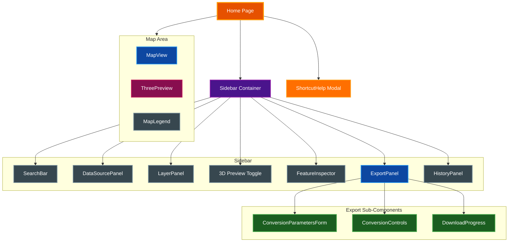
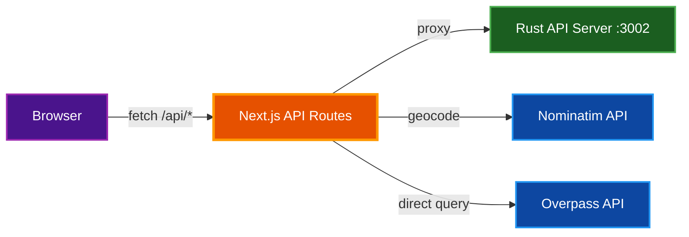
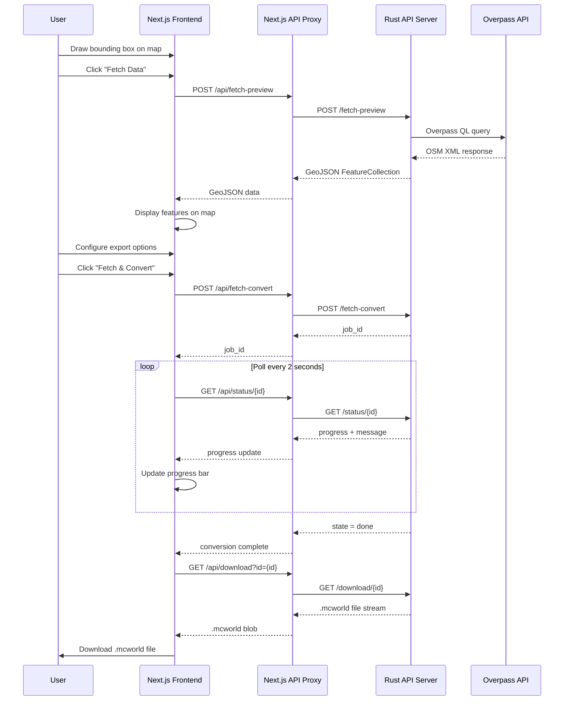

# Web Explorer

The Web Explorer is a Next.js frontend for browsing OpenStreetMap data on an interactive map and exporting it as playable Minecraft Bedrock Edition `.mcworld` files. It communicates with the Rust API server through a proxy layer and provides a rich set of tools for data selection, visualization, and conversion.

## Table of Contents

- [Overview](#overview)
- [Architecture](#architecture)
  - [Component Hierarchy](#component-hierarchy)
  - [Frontend to Backend Flow](#frontend-to-backend-flow)
- [Component Reference](#component-reference)
  - [Map Components](#map-components)
  - [Data Components](#data-components)
  - [Export Components](#export-components)
  - [Layout Components](#layout-components)
- [Hooks](#hooks)
- [API Proxy Layer](#api-proxy-layer)
  - [Next.js Proxy Routes](#nextjs-proxy-routes)
  - [Client-Side API Library](#client-side-api-library)
- [Data Flow](#data-flow)
- [Map Features](#map-features)
- [Configuration](#configuration)
  - [Environment Variables](#environment-variables)
  - [Conversion Presets](#conversion-presets)
- [Keyboard Shortcuts](#keyboard-shortcuts)
- [Development](#development)
- [Related Documentation](#related-documentation)

## Overview

The Web Explorer runs as a Next.js application on port `8031` alongside the Rust API server on port `3002`. Together they provide a browser-based workflow for selecting real-world areas, fetching OSM data, previewing features on a map, and converting them into Minecraft worlds.

**Starting both servers:**

```bash
make dev
```

This launches the Rust API on port `3002` and the Next.js dev server on port `8031`. Open `http://localhost:8031` in your browser.

**Key capabilities:**

- Location search via Nominatim geocoding
- Overpass API queries with bounding box selection
- PBF file upload and parsing
- Layer toggles for roads, buildings, water, landuse, railway, barriers, and cached areas
- Feature inspector showing OSM tags for clicked features
- Spawn point placement
- 3D block preview using Three.js
- Conversion to `.mcworld` with progress tracking and download
- Conversion history stored in localStorage
- Light and dark theme support
- Responsive layout with mobile sidebar

## Architecture

### Component Hierarchy

The root page (`page.tsx`) owns all top-level state and wires together the sidebar panels and map view. The component tree is structured as follows:



### Frontend to Backend Flow

All API calls from the browser go through Next.js proxy routes (`/api/*`), which forward requests to the Rust server. This avoids CORS issues and centralizes timeout and error handling.



## Component Reference

### Map Components

| Component | File | Description |
|-----------|------|-------------|
| **MapView** | `components/MapView.tsx` | OpenLayers map with tile layers, GeoJSON feature rendering, bounding box draw interaction, spawn mode, cached-area overlay, and a footer bar showing cursor coordinates. Computes live Minecraft `/tp` coordinates when a bbox is drawn. Includes a right-click context menu for setting spawn and copying teleport commands. |
| **MapLegend** | `components/MapLegend.tsx` | Collapsible floating legend overlay in the bottom-right corner of the map. Displays color swatches for each visible layer that has features. Hidden when no data is loaded. |
| **SearchBar** | `components/SearchBar.tsx` | Location search input with debounced Nominatim geocoding. Displays a dropdown of results navigable with arrow keys. Selecting a result flies the map to that location's bounding box. |

### Data Components

| Component | File | Description |
|-----------|------|-------------|
| **DataSourcePanel** | `components/DataSourcePanel.tsx` | Two-mode data source selector: **Overpass** mode fetches OSM data for the drawn bounding box via the Rust backend (cache-aware); **Upload** mode accepts `.osm.pbf` or `.osm` files via drag-and-drop or file picker, supporting multiple files that are merged. Includes an Advanced section for customizing the Overpass API URL (persisted to localStorage) and an Overture Maps section with per-theme toggles and priority controls. |
| **FeatureInspector** | `components/FeatureInspector.tsx` | Displays the properties and geometry type of the currently selected map feature. Separates OSM tags from internal tags (prefixed with `_`). Shows a type badge color-coded by feature category (road, building, water, landuse). |
| **LayerPanel** | `components/LayerPanel.tsx` | Lists all map layers with color dot indicators, feature count badges, and eye-icon visibility toggles. Layers include roads, buildings, water, landuse, railway, barriers, cached areas, and block preview. |

### Export Components

| Component | File | Description |
|-----------|------|-------------|
| **ExportPanel** | `components/ExportPanel.tsx` | Top-level export container that composes the conversion parameter form, action buttons, and progress display. Manages conversion state via the `useConversion` hook, builds option objects, and shows world-size estimates (blocks, chunks, estimated file size) with warnings for very large areas. |
| **ConversionParametersForm** | `components/ConversionParametersForm.tsx` | Form for all conversion settings: preset selector, world name, scale, building height, sea level, wall-straighten threshold, surface thickness, signs/address signs/POI/nature decoration toggles, elevation settings (vertical scale, smoothing), terrain-only mode, spawn point display with "Set" button, and feature filter switches (roads, buildings, water, landuse, railways). |
| **ConversionControls** | `components/ConversionControls.tsx` | Renders the action buttons based on current state: "Convert to .mcworld" (requires uploaded file), "Fetch & Convert from Overpass" (requires bbox, no file), and "Generate Terrain World" (terrain-only mode with bbox). Only visible when conversion is idle. |
| **DownloadProgress** | `components/DownloadProgress.tsx` | Progress bars and status indicators for conversion and download. Shows a conversion progress bar with percentage during processing, a download progress bar with byte counts during file transfer, a download link when complete, and error display with retry button on failure. |
| **ThreePreview** | `components/ThreePreview.tsx` | Three.js-based 3D block preview rendered via React Three Fiber. Uses instanced meshes grouped by block type for performance. Auto-positions the camera to fit the scene. Displays a spawn marker when a spawn point is set. Toggled from the sidebar's 3D Preview button. |

### Layout Components

| Component | File | Description |
|-----------|------|-------------|
| **Sidebar** | `components/Sidebar.tsx` | Fixed-width (320px on desktop) scrollable sidebar with app branding, theme toggle button, and close button on mobile. On mobile devices (below 768px), the sidebar renders as a bottom sheet covering 50% of the viewport. |
| **ShortcutHelp** | `components/ShortcutHelp.tsx` | Modal overlay listing all keyboard shortcuts. Displayed by pressing `?` and dismissed by clicking close or pressing `Escape`. |
| **HistoryPanel** | `components/HistoryPanel.tsx` | Expandable section showing the most recent 10 conversion history entries, each with world name and timestamp. Entries can be loaded to restore conversion settings. History is persisted in localStorage. |

## Hooks

| Hook | File | Description |
|------|------|-------------|
| **useMap** | `hooks/useMap.ts` | Core map state management. Initializes an OpenLayers map, provides `flyTo()` for animated navigation, `loadGeoJSON()` to parse and display feature collections on typed layers, `setLayerVisible()` for layer toggling, `enableBboxDraw()`/`disableBboxDraw()` for bounding box selection, `enableSpawnMode()`/`disableSpawnMode()` for spawn placement, `loadCacheAreas()` for displaying cached Overpass regions, and cursor position tracking. Returns feature counts per layer. |
| **useConversion** | `hooks/useConversion.ts` | Manages the full conversion lifecycle. Provides `startConversion()` for PBF file upload conversion, `startFetchConvert()` for Overpass fetch-and-convert, `startTerrainConvert()` for SRTM-only terrain, and `startOvertureConvert()` for Overture Maps data. Handles job ID polling at 2-second intervals, tracks progress percentage and status messages, streams the `.mcworld` download with byte-level progress, and exposes `reset()` to clear state. |
| **usePreview** | `hooks/usePreview.ts` | Manages 3D block preview generation. Provides `generatePreview()` for PBF-file-based previews and `generatePreviewFromBbox()` for bbox-based previews fetched from Overpass. Returns block positions, world bounds, spawn coordinates, and loading/error state. |
| **useConversionHistory** | `hooks/useConversionHistory.ts` | Persists conversion history entries (world name, timestamp, settings, bbox) to localStorage under the key `osm-conversion-history`. Stores up to 20 entries. Provides `addEntry()` and `clearHistory()`. |
| **useKeyboardShortcuts** | `hooks/useKeyboardShortcuts.ts` | Registers global keyboard event handlers for shortcuts. Ignores keypresses when focus is on input, textarea, or select elements. Manages the help modal's visibility state. Accepts callback actions for draw-box toggle, layer toggle, cancel, and search focus. |
| **useTheme** | `hooks/useTheme.ts` | Manages dark/light theme state. Persists the choice to localStorage under `osm-theme` and sets the `data-theme` attribute on the document root. Defaults to dark mode. |
| **useMediaQuery** | `hooks/useMediaQuery.ts` | SSR-safe wrapper around `window.matchMedia()`. Used by the root page to detect desktop vs. mobile layout (`min-width: 768px`). Returns a boolean indicating whether the query matches. |

## API Proxy Layer

### Next.js Proxy Routes

All backend communication is proxied through Next.js API routes to the Rust server at `NEXT_PUBLIC_API_URL` (default `http://localhost:3002`). Timeout budgets are centralized in `lib/api-config.ts`.

| Next.js Route | Method | Proxies To | Description |
|---------------|--------|------------|-------------|
| `/api/health` | GET | `GET /health` | Liveness check; reports Overture CLI availability |
| `/api/upload` | POST | `POST /parse` | Multipart PBF upload, returns GeoJSON + bounds + stats |
| `/api/convert` | POST | `POST /convert` | Multipart PBF upload + options, starts conversion job |
| `/api/fetch-convert` | POST | `POST /fetch-convert` | Fetch from Overpass + convert in one step |
| `/api/terrain-convert` | POST | `POST /terrain-convert` | SRTM-only terrain world generation |
| `/api/overture-convert` | POST | `POST /overture-convert` | Overture Maps data conversion |
| `/api/preview` | POST | `POST /preview` | Generate 3D block preview from uploaded PBF |
| `/api/fetch-preview` | POST | `POST /fetch-preview` | Fetch OSM data + return GeoJSON for map display |
| `/api/fetch-block-preview` | POST | `POST /fetch-block-preview` | Fetch from Overpass + generate 3D block preview |
| `/api/status/[id]` | GET | `GET /status/{id}` | Poll conversion job progress |
| `/api/download?id=` | GET | `GET /download/{id}` | Download completed `.mcworld` file |
| `/api/cache` | GET | `GET /cache/areas` | List cached Overpass bbox entries |
| `/api/geocode` | GET | Nominatim API | Forward geocoding via OpenStreetMap Nominatim |
| `/api/overpass` | POST | Overpass API | Direct Overpass QL query (SSRF-protected allowlist) |

### Client-Side API Library

Two library files support API communication:

- **`lib/api-config.ts`** -- Single source of truth for the Rust API base URL (`RUST_API_URL`) and per-route timeout budgets (SHORT, UPLOAD, CONVERT, FETCH_CONVERT, TERRAIN_CONVERT, DOWNLOAD). All proxy routes import from this module.
- **`lib/api.ts`** -- Client-side convenience functions (`parsePBF()`, `startConversion()`, `getStatus()`, `getDownloadUrl()`) with built-in timeout handling. Used for direct Rust API calls from client code.

## Data Flow

The typical user workflow from data selection through download follows this sequence:



## Map Features

The map is built on OpenLayers and provides the following capabilities:

- **Tile base layer** -- Standard OpenStreetMap tiles with cursor position tracking (latitude, longitude, zoom level)
- **Bounding box drawing** -- Click and drag to draw a rectangle defining the area to fetch or convert. The drawn bbox coordinates are displayed in the Data Source panel
- **Layer toggles** -- Independent visibility controls for roads, buildings, water, landuse, railway, barriers, cached areas, and block preview layers. Each layer is styled with a distinct color
- **Feature inspector** -- Click any feature on the map to view its OSM tags, geometry type, and node count in the sidebar inspector panel
- **Spawn point placement** -- Enter spawn mode from the Export panel or right-click the map and select "Set spawn here" from the context menu. A gold marker indicates the chosen spawn location
- **Live /tp coordinates** -- When a bounding box is drawn, the map footer shows real-time Minecraft `/tp @s X Y Z` coordinates based on cursor position. Click to copy the command to clipboard. The coordinates are calculated using the configured scale and sea level parameters
- **Right-click context menu** -- Two options: "Set spawn here" (always available) and "Copy /tp command" (available when a bbox is drawn, calculates block coordinates from the cursor position)
- **Cached area overlay** -- Displays rectangles showing previously cached Overpass query regions. The overlay refreshes after each conversion completes

## Configuration

### Environment Variables

| Variable | Default | Description |
|----------|---------|-------------|
| `NEXT_PUBLIC_API_URL` | `http://localhost:3002` | Base URL of the Rust API server |

Copy `web/.env.local.example` to `web/.env.local` and adjust if the Rust API runs on a different host or port.

The **Overpass API URL** can also be customized in the Data Source panel's Advanced section. The custom URL is persisted to localStorage under the key `overpass_url`.

### Conversion Presets

Three built-in presets are defined in `lib/presets.ts`:

| Preset | Scale | Building Height | Sea Level | Signs |
|--------|-------|-----------------|-----------|-------|
| Detailed City | 1.0 | 12 | 65 | On |
| Regional Overview | 3.0 | 6 | 65 | Off |
| Natural Landscape | 1.0 | 4 | 65 | Off |

Selecting a preset updates scale, building height, sea level, and signs. Manually changing any parameter switches the preset to "Custom".

## Keyboard Shortcuts

| Key | Action |
|-----|--------|
| `D` | Toggle draw-box mode |
| `K` | Toggle all layers |
| `/` | Focus search bar |
| `Esc` | Cancel current mode (draw, spawn) or close help |
| `?` | Toggle keyboard shortcuts help |

> **Note:** Shortcuts are disabled when focus is on an input, textarea, or select element.

## Development

**Prerequisites:** Install `bun` for the JavaScript runtime and package manager.

**First-time setup:**

```bash
cd web && bun install
```

**Development commands:**

```bash
make web-dev       # Start Next.js dev server on port 8031
make dev           # Start both Rust API (port 3002) and Next.js (port 8031)
make web-build     # Production build
make web-kill      # Kill Next.js dev server
make kill          # Kill both servers
```

**From the `web/` directory:**

```bash
bun run dev        # Dev server on port 8031
bun run build      # Production build (next build)
bun run lint       # ESLint
```

## Related Documentation

- [CLI Reference](CLI.md) -- Command-line usage for the Rust converter
- [Developer Info](DEVELOPER_INFO.md) -- Architecture and module overview
- [Minecraft Bedrock Map Format](MINECRAFT_BEDROCK_MAP_FORMAT.md) -- LevelDB chunk format details
- [Minecraft Bedrock Tools and Import](MINECRAFT_BEDROCK_TOOLS_AND_IMPORT.md) -- How to import `.mcworld` files
